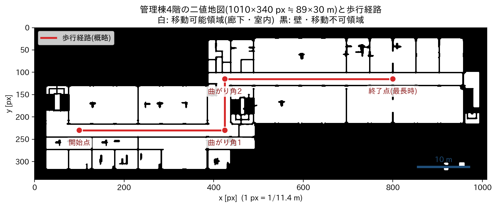
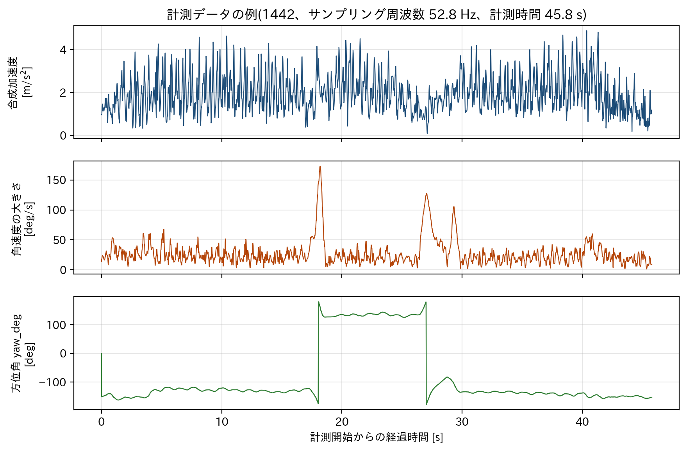
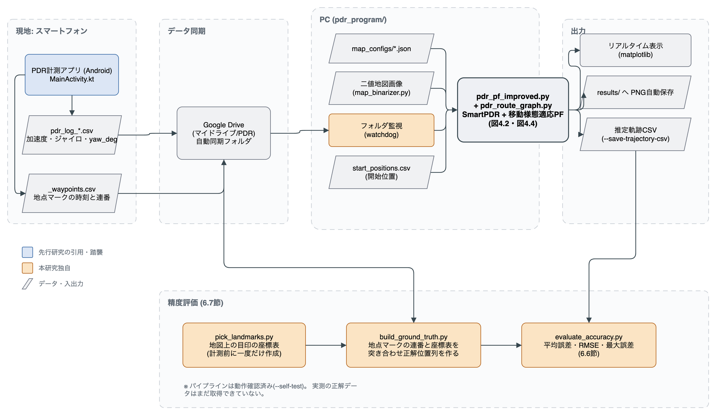
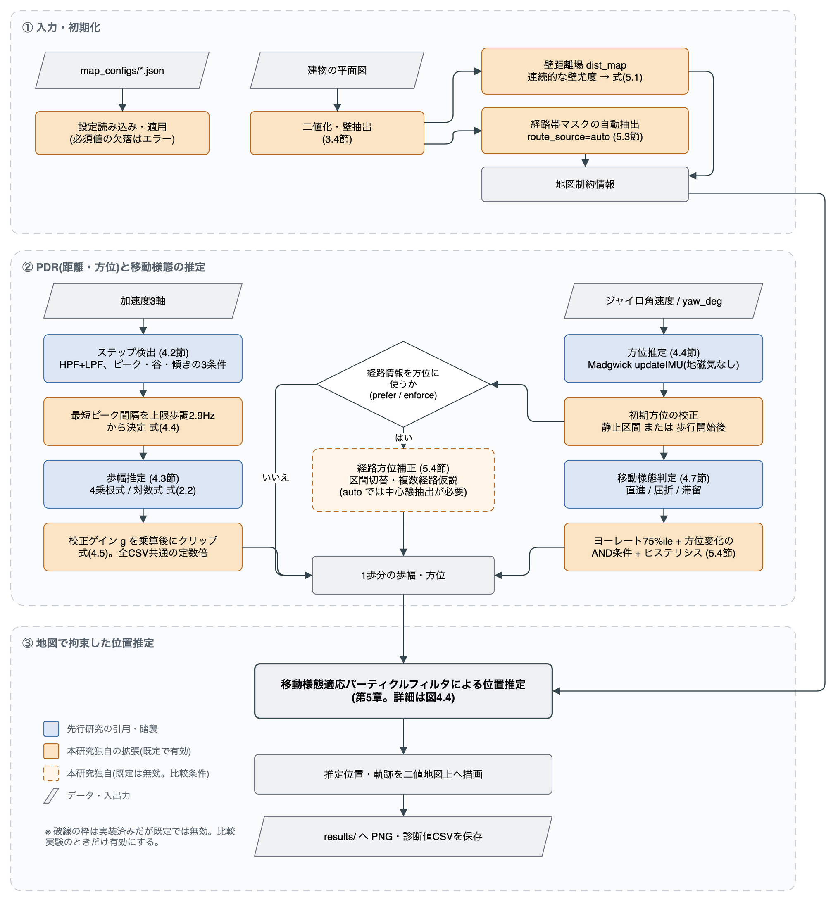
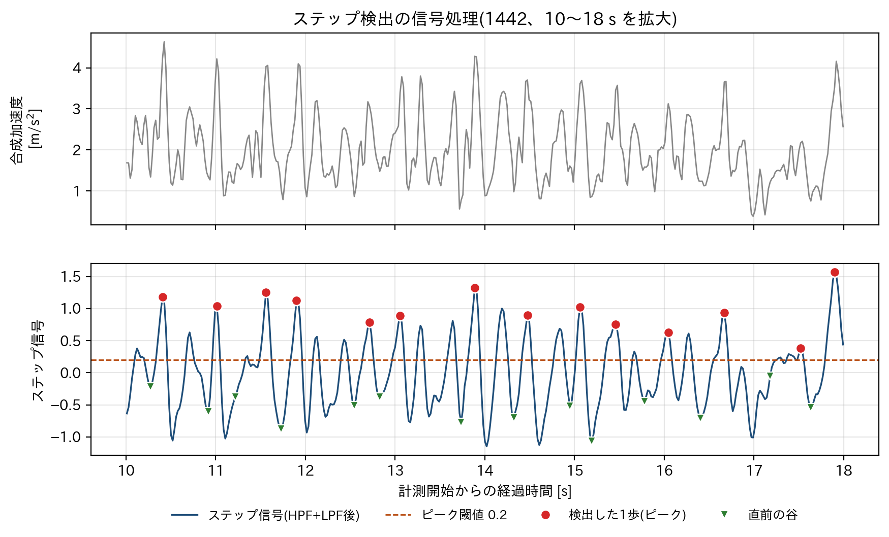
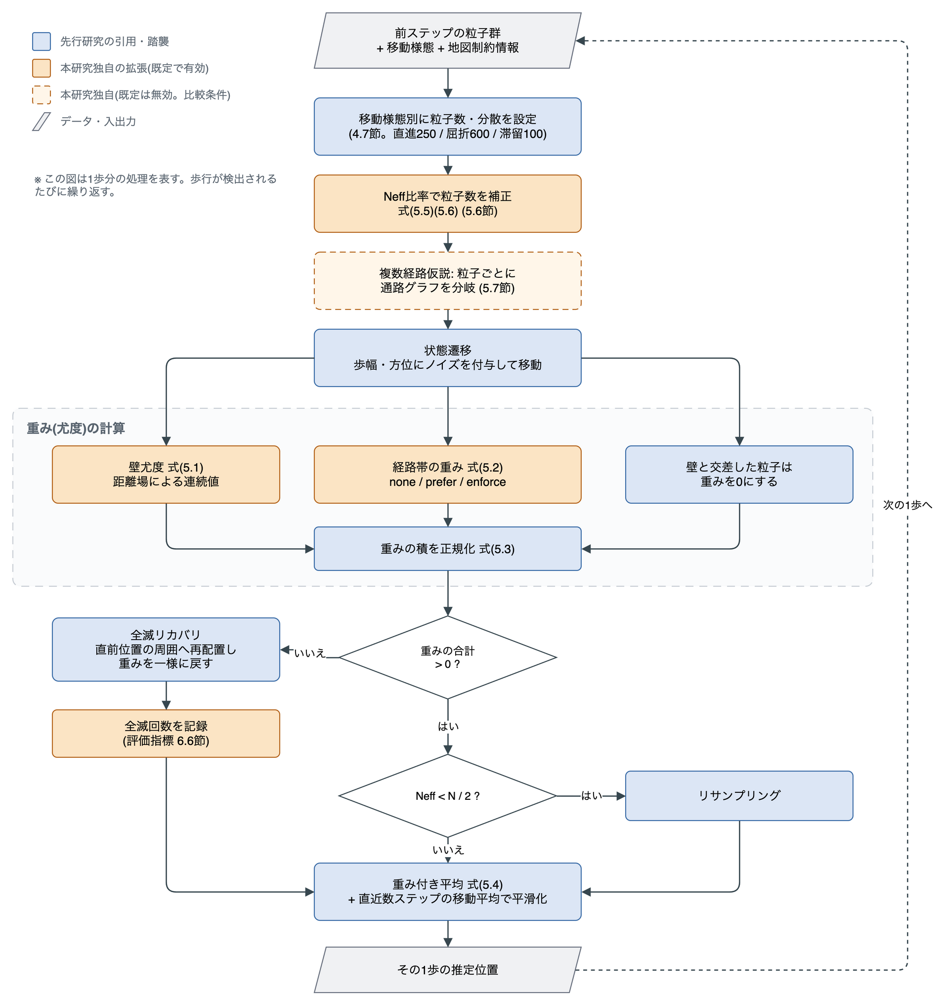
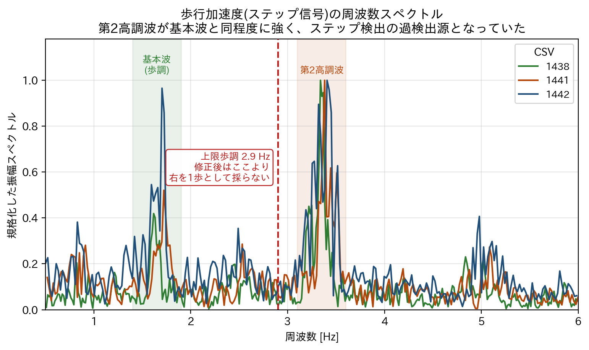
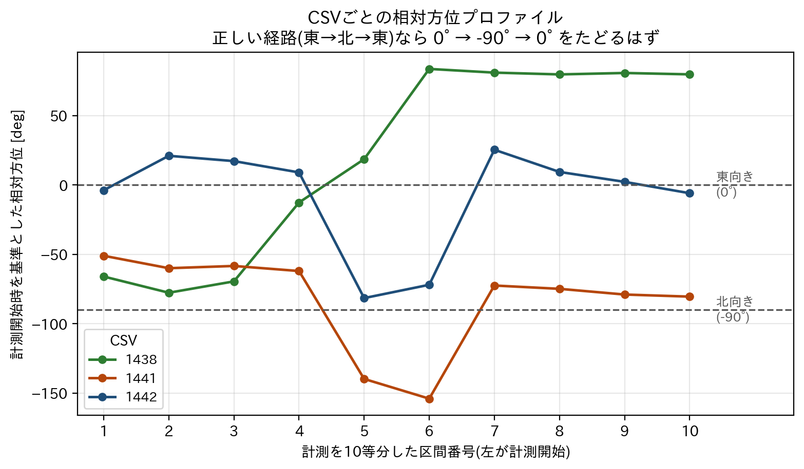

> **この雛形について（自動生成ファイル・直接編集しないこと）**
> 章立ては `進捗反映版メモ.txt` 13節「卒業論文の章題構成例」、
> 本文は `CLAUDE_MEMO.txt` から `build_thesis_docx.py` が自動生成した。
> 内容を追記・修正する場合は `CLAUDE_MEMO.txt` を編集すること
> （編集すると自動でこのファイルと.docxが再生成される）。
> 未執筆の節は「・ここには〜を書く」という執筆指示のプレースホルダのまま。

---

# 第1章　はじめに

## 1.1 研究背景

現在、屋外における位置情報の取得は、GPS(Global Positioning System)をはじめとする
衛星測位システムによってほぼ日常的な技術となっている。スマートフォンに標準搭載
された測位機能により、経路案内、配車、位置連動型の情報配信といったサービスが広く
普及し、利用者は自分の位置が数メートルの精度で分かることを前提として行動する
ようになっている。

一方で、人が一日のうちに過ごす時間の大半は建物の内部である。大規模な商業施設、
病院、駅、学校、オフィスビルなどでは、目的の場所へたどり着くまでに複雑な通路を
たどる必要があり、屋外と同等の案内が受けられれば利便性は大きく向上する。また、
災害時の避難誘導や、施設内での作業者・機材の所在把握といった用途でも屋内位置情報
の需要は高い。しかし後述するように、屋外で用いられている衛星測位は建物の内部では
十分な精度が得られない。

屋内測位を実現する手段としては、Wi-Fiアクセスポイントの電波強度、BLEビーコン、
地磁気の空間分布、超広帯域無線(UWB)などを用いる方式が提案されている。しかし
これらはいずれも、建物側に機器を設置するか、事前に建物全体を歩き回って電波強度や
地磁気の分布(フィンガープリント)を作成する作業を必要とする。これに対し、
スマートフォンに標準搭載されている加速度センサとジャイロセンサだけを用いる方式で
あれば、追加の設備投資も事前の電波調査も不要であり、利用者が普段持ち歩いている
端末をそのまま使える点で導入の敷居が低い。本研究がスマートフォン単体による屋内
測位を対象とする理由はここにある。

## 1.2 屋内GPS測位の問題点

GPSは、地球を周回する複数の測位衛星から送信される信号の到達時間から衛星と受信機
の距離(擬似距離)を求め、4機以上の衛星について同時にこれを解くことで受信機の
3次元位置と受信機時計の誤差を決定する方式である。この原理は、衛星からの信号が
直進して受信機に届くことを前提としている。

建物の内部では、この前提が二重に崩れる。第一に、衛星信号はきわめて微弱な電波で
あり、屋根・天井・壁などの構造物によって大きく減衰する。受信できる衛星数が4機を
下回れば測位そのものが成立せず、受信できたとしても衛星配置が偏るため精度は大きく
劣化する。第二に、直進して届かなかった信号が壁や周囲の建物で反射して受信機へ到達
する、いわゆるマルチパスが生じる。反射した信号は本来の直線距離より長い経路を通って
いるため擬似距離が実際より長く見積もられ、測位結果に大きな誤差が生じる。しかも
受信機側からは、その信号が直達波なのか反射波なのかを区別することが難しい。

つまり屋内でのGPS測位は「測れない」だけでなく、「測れているように見えて大きく
間違っている」ことがある点が問題であり、そのまま屋内案内に用いることはできない。

## 1.3 PDRを用いる理由

PDR(Pedestrian Dead Reckoning、歩行者自律航法)は、外部からの位置情報を用いず、
歩行者自身の動きの積み重ねから位置を推定する方式である。既知の出発点から始めて、
「1歩あるいた」ことを検出し、「その1歩がどれだけの長さだったか(歩幅)」と
「どちらの方向へ進んだか(方位)」を推定し、これを歩くたびに足し合わせていくことで
現在位置を求める。

PDRの利点は、必要な情報がすべて歩行者自身に付随している点にある。衛星信号も、
建物側に設置したビーコンも、事前の電波調査も必要としない。スマートフォンに標準
搭載された加速度センサとジャイロセンサから得られる信号だけで、上記の3要素
(ステップ・歩幅・方位)はすべて推定できる。したがって、建物側の協力が得られない
場所や、新たな設備投資ができない場所でも適用できる。また、電波環境の変化
(アクセスポイントの増設・撤去、什器の配置替え)に影響されないという安定性もある。

本研究がPDRを基礎方式として選んだのは、この「追加設備を必要としない」という性質
が、屋内測位を広く普及させるうえで本質的な利点になると考えたためである。

## 1.4 PDRの課題

一方でPDRには、その原理そのものに由来する根本的な課題がある。PDRは直前の推定位置
に1歩分の変位を足し込む相対的な方式であるため、各要素の誤差が消えずに蓄積する。

歩数の誤差は、加速度信号のどのピークを1歩と数えるかという判定に依存する。閾値の
設定が緩ければ手ぶれや歩行以外の振動を歩数として数えてしまい、厳しすぎれば歩幅の
小さい歩行を取りこぼす。歩幅の誤差については、加速度の振幅から歩幅を推定する経験式
が一般に用いられるが、この式の係数は被験者の体格・歩き方や端末の保持方法に依存する
ため、係数を求めた環境と異なる環境ではそのままでは使えない。方位の誤差については、
ジャイロの角速度を積分して方位を求める過程で、センサのバイアスが時間に比例した方位
のずれ(ドリフト)として蓄積する。

これらの誤差の性質で特に問題となるのは、いずれも一度生じると自然には解消されない点
である。歩数を1歩多く数えれば、その分の距離はそれ以降のすべての推定位置にずれとして
残り続ける。方位が1度ずれれば、以降に歩いた距離に比例して横方向の誤差が広がって
いく。したがってPDR単体では、歩行距離が伸びるほど誤差が単調に増大し、長い経路では
実用にならない。

この蓄積誤差を抑えるには、外部から独立した情報を与えて位置を拘束する必要がある。
本研究では、その情報として建物の地図を用いる。歩行者は壁を通り抜けることができず、
通常は廊下に沿って移動するという物理的な制約は、追加の設備を必要とせずに得られる
強力な事前知識である。この制約を確率的に扱う枠組みとして、本研究ではパーティクル
フィルタを用いる。

## 1.5 研究目的

本研究の目的は、スマートフォンのIMU(加速度センサ・ジャイロセンサ)のみを入力と
するPDRに対し、建物の二値地図から得られる形状情報によって拘束する移動様態適応型
パーティクルフィルタを組み合わせた屋内測位方式を提案し、その有効性を実測データに
よって評価することである。

提案方式は、先行研究であるSmartPDRと移動様態適応型パーティクルフィルタを土台と
したうえで、地図の形状情報をより積極的に利用する方向へ拡張したものである。具体的
には、(1)壁までの距離を連続的な尤度として粒子の重みに反映すること、(2)二値地図
から通路領域を自動的に抽出して粒子の存在範囲を制約すること、(3)推定の不確実性に
応じて粒子数を動的に変更すること、の3点を主たる拡張とする。

評価は、著者の所属する学校の管理棟4階を実験環境として行う。この環境は、長い直線
廊下と2箇所の直角の曲がり角を含むため、直線区間における距離誤差の蓄積と、曲がり角
における方位推定・経路選択の正しさの両方を、同一の経路上で評価できる。評価指標と
しては位置精度に加え、平均粒子数と処理時間による計算量も測定し、精度と計算コストの
両面から提案方式を検討する。

## 1.6 本論文の構成

第2章では、GPS測位、PDR、パーティクルフィルタの基礎と、本研究が土台とする2つの
先行研究(SmartPDR、移動様態適応型パーティクルフィルタ)について述べ、本研究との
違いを整理する。第3章では、実験環境である管理棟4階、使用した端末とセンサ、記録
したデータの形式、および建物地図と正解経路の作成方法を述べる。第4章では、先行研究
に基づく従来方式の実装を、ステップ検出・歩幅推定・方位推定・位置更新・パーティクル
フィルタの順に述べ、その予備実験の結果を示す。第5章では、本研究が提案する拡張
(通路構造の抽出、地図を用いた曲がり判定、不確実性に基づく粒子数変更、複数経路仮説)
を述べる。第6章では実験の方法、比較する方式、パラメータ、評価指標を述べる。第7章に
実験結果を、第8章にその考察を示す。第9章で本研究をまとめ、今後の展望を述べる。

---

# 第2章　関連技術と先行研究

## 2.1 GPSによる測位

GPSは、既知の軌道を周回する測位衛星から、時刻情報を載せた信号を地上へ送信する
仕組みである。受信機は、受信した信号に含まれる送信時刻と自身の受信時刻の差から
信号の伝搬時間を求め、これに光速を掛けて衛星までの距離を得る。ただし受信機の時計は
衛星に搭載された原子時計ほど正確ではないため、この距離には共通の時計誤差が含まれる。
そこで求める未知数を3次元位置(x, y, z)と受信機時計誤差の4つとし、4機以上の衛星に
ついて同時に方程式を立てて解くことで測位が成立する。この、時計誤差を含んだ見かけの
距離を擬似距離と呼ぶ。

屋内で精度が低下する理由は1.2節で述べたとおり、信号の減衰による可視衛星数の不足と、
反射波の受信によるマルチパス誤差の2つである。特にマルチパスは、擬似距離を実際より
長い側へ偏らせる系統的な誤差として働くため、多数回の測位結果を平均しても取り除く
ことができない。

## 2.2 PDR

PDRは、直前の推定位置に1歩分の変位を加算していく位置推定方式である。$k$歩目の推定
位置を$(x_k,\,y_k)$、その歩の歩幅を$l_k$、方位を$\theta_k$とすると、位置は次式で
更新される。

$$
\begin{aligned}
x_k = x_{k-1} + l_k \cos \theta_k \\
y_k = y_{k-1} + l_k \sin \theta_k
\end{aligned}
\qquad\qquad (2.1)
$$

ここで$\theta_k$は地図座標系における進行方向の角度である。この式が示すとおり、PDRの実装は
「いつ1歩あるいたかを検出する処理(ステップ検出)」「その歩の長さを求める処理
(歩幅推定)」「その歩の向きを求める処理(方位推定)」の3つに分解される。

ステップ検出は加速度センサから、方位推定はジャイロセンサ(および必要に応じて加速度
センサ・地磁気センサ)から行う。歩幅は直接測定できる量ではないため、加速度信号の
振幅や歩調といった観測量から経験式によって推定するのが一般的である。この3要素は
いずれも独立した誤差要因を持ち、その誤差は上式の加算を通じて位置に蓄積していく。

なお、初期位置$(x_0,\,y_0)$と初期方位$\theta_0$はPDR自身では決定できず、外部から
与える必要がある。本研究では初期位置を地図上で指定し、初期方位は計測開始時の端末方位を地図上の
既知の向きに対応づけることで与えている。

## 2.3 SmartPDR

SmartPDRは、スマートフォン単体で動作する屋内PDRとして提案された方式であり、
ステップ検出・歩幅推定・方位推定の3処理をすべてスマートフォン内蔵センサのみで
完結させる構成をとる。本研究のPDR部分はこの方式を踏襲している。

ステップ検出では、まず3軸加速度の合成値(ノルム)を求める。合成値には重力加速度が
定常成分として含まれるため、ハイパスフィルタによってこの低周波成分を除去し、続いて
ローパスフィルタ(移動平均)によって高周波のノイズを平滑化して、歩行の周期成分を
強調した信号(以下、ステップ信号と呼ぶ)を作る。この信号に対し、(1)一定の閾値を
超えるピークであること、(2)そのピークと前後の谷との振幅差が閾値を超えること、
(3)ピークの前で信号が上昇し、後で下降していること(傾き条件)、の3条件を満たす点を
1歩とみなす。単一の閾値によるピーク検出と比べ、手ぶれや端末の揺れによる誤検出を
抑えられる点がこの3条件の狙いである。

歩幅推定では、1歩ごとのピークと谷の振幅差(以下、衝撃量と呼び$A_k$と書く)から歩幅を
推定する。衝撃量が閾値$\tau$より小さい場合には4乗根式を、大きい場合には対数式を用いる
という2式の切り替えを行う。

$$
l_k =
\begin{cases}
\beta_{\mathrm{r}} \sqrt[4]{A_k} + \gamma_{\mathrm{r}} & (A_k < \tau) \\[2pt]
\beta_{\ell} \ln A_k + \gamma_{\ell} & (A_k \ge \tau)
\end{cases}
\qquad\qquad (2.2)
$$

これらの式に含まれる係数$\beta_{\mathrm{r}},\,\gamma_{\mathrm{r}},\,
\beta_{\ell},\,\gamma_{\ell}$および閾値$\tau$は、原論文の被験者と端末による計測から
同定されたものである。この係数の環境依存性は本研究において重要な問題となったため、
8.4節で詳しく論じる。

方位推定では、加速度センサとジャイロセンサ(および地磁気センサ)から端末の姿勢を
推定し、そこから水平面内の進行方向を求める。

## 2.4 パーティクルフィルタ

パーティクルフィルタは、状態の確率分布を多数の標本(粒子)の集合として近似的に表現
する逐次ベイズ推定手法である。分布が正規分布に従うことも、システムが線形であることも
仮定しないため、地図の壁形状のように複雑で不連続な制約を扱うのに適している。

1回の更新は次の3段階からなる。第一は予測(状態遷移)であり、各粒子を運動モデルに
従って移動させる。本研究の場合、これは各粒子を推定歩幅・推定方位にノイズを加えた量
だけ進めることに相当する。第二は重み計算であり、観測から見た各粒子のもっともらしさ
(尤度)を求めて重みとする。第三はリサンプリングであり、重みに比例した確率で粒子を
復元抽出して、重みの小さい粒子を淘汰し大きい粒子を複製する。この3段階を1歩ごとに
繰り返すことで、粒子の集合はもっともらしい位置の分布へ収束していく。

パーティクルフィルタが地図拘束に適しているのは、地図が与える制約を「重み」という形
で自然に取り込めるためである。壁の内部に入り込んだ粒子の重みを0にすれば、その粒子は
次のリサンプリングで淘汰され、結果として推定分布から壁の内部が除かれる。この操作は、
位置の確率分布を陽な数式として扱うことなく実現できる。

一方で粒子数は有限であるため、粒子の集合が実際の位置から離れた場所に偏ってしまうと
復帰できないという問題がある。この状態は、有効サンプルサイズ(以下$N_{\mathrm{eff}}$)
と呼ばれる指標

$$
N_{\mathrm{eff}} = \frac{1}{\displaystyle\sum_{i=1}^{N} w_i^{2}}
\qquad\qquad (2.3)
$$

によって定量的に把握できる。ここで$w_i$は正規化した重み($\sum_i w_i = 1$)、$N$は
粒子数である。$N_{\mathrm{eff}}$は全粒子の重みが等しいとき粒子数$N$に一致し、1個の
粒子に重みが集中するとき1に近づく。すなわち$N_{\mathrm{eff}}$が小さいほど、実質的に推定へ寄与して
いる粒子が少なく、推定が不安定であることを意味する。本研究ではこの$N_{\mathrm{eff}}$を、粒子数を
動的に変更する際の判断材料として用いる(5.5節・5.6節)。

## 2.5 移動様態適応型パーティクルフィルタ

本研究が土台とするもう一つの先行研究は、秋山高行らによる「移動様態に応じた
パーティクルフィルタによる歩行者自律測位方式の提案と評価」(FIT2013)である。
以下ではこれを移動様態PF論文と呼ぶ。

この方式の着想は、歩行者の運動には性質の異なる複数の局面があり、それぞれに適した
粒子の散らし方が異なるという点にある。直線の廊下を歩いているとき、進行方向はほとんど
変化しないため、方位に大きなノイズを与える必要はなく、少ない粒子数でも推定は安定する。
これに対して曲がり角では、どちらへ何度曲がるかという不確実性が急激に増すため、方位に
大きなノイズを与え、粒子数も増やして広い範囲の可能性を保持しておく必要がある。立ち
止まっているときは位置がほとんど変化しないため、粒子を散らす必要がない。

そこで移動様態PF論文では、歩行を直進・屈折・滞留の3つの移動様態に分類し、様態ごとに
粒子数と、歩幅・方位のノイズ分散を切り替える。屈折の判定には、8秒間の方位変化が
30度以上であるかという固定閾値が用いられている。これにより、常に大量の粒子を用いる
固定粒子数方式に比べ、精度を保ちながら平均粒子数すなわち計算量を削減できることが
示されている。

この方式には2つの課題がある。1点目は、屈折判定が単一の固定閾値によるため、手ぶれの
ような瞬間的な方位変化を屈折と誤判定しやすいことである。2点目は、粒子数と分散を変える
だけで、建物地図の形状情報そのものは利用していないことである。曲がり角がどこにあり、
そこから通路がどの方向へ伸びているかという情報は地図から得られるにもかかわらず、この
方式ではそれを用いていない。本研究はこの2点を出発点として拡張を行う。

## 2.6 先行研究と本研究の違い

本研究のPDR・パーティクルフィルタ(PF)処理は、SmartPDR(Smartphone-Based
Pedestrian Dead Reckoning for Indoor Localization)と、秋山高行ほかによる
「移動様態に応じたパーティクルフィルタによる歩行者自律測位方式の提案と評価」
(FIT2013、以下「移動様態PF論文」)という2つの先行研究を土台としている。しかし
これら2つの先行研究には共通する重要な限界があり、本研究はその限界を解消する
方向で拡張を加えている。

SmartPDRとの違いについては、まずステップ検出・歩幅推定の基本処理(ハイパスフィルタ
とローパスフィルタによる加速度合成値の平滑化、ピーク・谷・傾きの3条件による歩行
検出、歩幅を対数式と4乗根式の2種類の式で閾値によって切り替える手法)はSmartPDRの
手法をそのまま踏襲している。しかしSmartPDR自体は屋内の建物地図情報を一切用いて
おらず、センサから求めたステップ・歩幅・方位の推定値をそのまま積算して軌跡を出力
するだけであるため、センサ誤差やドリフトが時間とともに無制限に蓄積するという課題
を本質的に抱えている。本研究では、この蓄積誤差を二値地図とパーティクルフィルタに
よって補正する枠組みをSmartPDRの上に載せている点が最も大きな違いである。

移動様態PF論文との違いは、大きく2点ある。1点目は移動様態(直進・屈折・滞留)の判定
方法である。移動様態PF論文は8秒間の方位変化が30度以上かどうかという単純な固定閾値
で「屈折(曲がり)」を判定しているが、本研究ではヨーレートの75パーセンタイル値と
方位変化量のAND条件、さらに曲がりの開始・終了で異なる閾値を用いるヒステリシス処理
を組み合わせることで、手ぶれなど瞬間的なノイズによる誤判定を抑える方向に改良して
いる。2点目は、移動様態PF論文が移動様態に応じて粒子数・分散を変えるだけで建物地図
の形状情報を一切利用していないのに対し、本研究では二値地図から求めた壁までの
距離場を連続的な尤度として粒子重みに反映する処理(従来手法の0/1二値の壁判定とは
異なる)と、地図から得られる通路領域を用いて粒子を経路帯内に制約する処理を追加して
いる点である。

以上をまとめると、本研究が2つの先行研究に対して加えている拡張は、(1)連続的な
壁尤度による重み付け、(2)地図から得られる通路領域を用いた経路制約、(3)手ぶれに
強い移動様態判定、の3点であり、いずれも「地図の形状情報を積極的に使う」という
方向性で一貫している。ただし、経路制約に用いる通路情報を人手で用意するか地図から
自動抽出するかによって、本研究の独自性の度合いは変わってくる。この点については
第5章・第8章で詳しく述べる。

---

# 第3章　研究対象と使用データ

## 3.1 実験環境

実験は、著者の所属する学校の管理棟4階を対象として行った。この階は、建物の西側から
東側へ伸びる長い廊下を主軸とし、途中で南北方向に折れる箇所を持つ構造をしている。
廊下の両側には教室・実習室・事務室などが並んでいる。

この環境を選定した理由は3点ある。第一に、東西方向におよそ71mの連続した歩行区間が
取れるため、PDRの累積誤差が十分に大きく現れ、地図拘束の効果を評価できることである。
第二に、経路の途中に直角の曲がり角が2箇所あり、直線区間における距離誤差の蓄積と、
曲がり角における方位推定・経路選択の正しさを、同一の計測データの中で同時に評価できる
ことである。第三に、日常的に立ち入ることができ、同じ経路を繰り返し歩いて計測できる
ことである。

評価に用いる歩行経路は、西側の廊下を東へ進み、地図座標で(425, 230)付近の曲がり角で
北へ折れ、(425, 115)付近の曲がり角で再び東へ折れ、東西に長い廊下を東端付近まで進む
というものである(図3.1)。この経路の全長は地図上で815pxであり、後述する縮尺
(11.4px/m)に換算するとおよそ71.5mである。

(要記入: 建物の正式名称、階の用途、廊下の実測幅を確認して記載する。)

## 3.2 使用したスマートフォン

計測にはAndroid端末を1台用い、著者が作成した計測アプリケーションによってセンサ値を
CSVへ記録した。使用したセンサは、加速度センサ(TYPE_ACCELEROMETER)、ジャイロセンサ
(TYPE_GYROSCOPE)、および回転ベクトルセンサ(TYPE_ROTATION_VECTOR)である。回転
ベクトルセンサはOS側で複数のセンサを統合して端末姿勢を出力するもので、本研究では
ここから得られる方位角をyaw_degとして記録している。

センサ値の記録周期は端末とOSに委ねているため厳密には一定ではないが、本研究で用いた
3件のデータではいずれもサンプリング周波数の中央値が52.8Hzであった。この値は、後述
するステップ検出の最短ピーク間隔を決める際に、記録されたタイムスタンプから毎回自動的
に計算して用いている。

(要記入: 端末の機種名、Androidのバージョンを記載する。)

## 3.3 PDRデータ

記録されるCSVは1行が1サンプルに対応し、列は timestamp, acc_x, acc_y, acc_z,
gyro_x, gyro_y, gyro_z, yaw_deg, x, y である。timestampは秒単位の経過時刻、acc_*は
端末座標系における3軸加速度$[\mathrm{m/s^2}]$、gyro_*は同じく3軸角速度$[\mathrm{rad/s}]$、yaw_degは回転
ベクトルセンサ由来の方位角[deg]である。末尾のx, yは計測アプリが画面表示のために自ら
計算した簡易的な推定位置であり、本研究の解析ではこの2列を一切用いず、acc_*・gyro_*・
yaw_degの生値から改めて推定をやり直している。

計測は、経路の開始点に立った状態でアプリの記録を開始し、経路を歩き終えた時点で記録を
停止するという手順で行った。本研究の主たる評価に用いるのは2026年8月5日に取得した3件
(pdr_log_0805_1438.csv、同1441.csv、同1442.csv)であり、記録長はそれぞれ66.8秒
(3530サンプル)、48.2秒(2547サンプル)、45.8秒(2420サンプル)である。図3.2に、
このうち1442の合成加速度・角速度・方位角の時系列を示す。方位角の波形が途中で±180度を
またいで不連続に見えるのは角度の折り返しによるものであり、センサの異常ではない。

なお、後述する正解位置データの記録機能(地点マークボタン)と地磁気センサの記録は、
これら3件の計測を行った後に計測アプリへ追加したものであり、この3件には含まれていない。

## 3.4 建物地図

建物地図には、管理棟4階の建築平面図を基に作成した二値画像を用いた。二値化は
map_binarizer.pyによって行っており、平面図をグレースケール化して閾値処理したうえで、
細い線分の除去、微小な壁領域の除去、壁のわずかな途切れを埋める処理を適用し、最後に
廊下内の1点を与えてそこから連結している領域だけを抽出することで、歩行者が到達しうる
領域を残している。

得られた二値地図は1010×340pxで、白が移動可能領域(廊下および室内)、黒が壁および
移動不可領域を表す(図3.1)。パーティクルフィルタはこの白領域の内部でのみ粒子を保持し、
黒領域と交差する移動を禁止する。

縮尺は、平面図上で実際の長さが既知の区間の両端をクリックし、その画素距離から求めた
(measure_map_scale.py)。本研究で用いた地図では11.4px/mであり、画像全体は実寸で
およそ88.6m×29.8mに相当する。1pxはおよそ8.8cmである。この値は
map_configs/kanri_4f.jsonのscale_px_per_mとしてプログラムへ与えられ、歩幅[m]から画素
単位への変換にそのまま用いられる。

## 3.5 正解経路

推定精度を評価するには、歩行者が実際にいつどこにいたかという正解データが必要である。
本研究では2段階の正解データを用いる。

第一は、経路の概略を表す折れ線である。これは計測直後に歩行者本人の記憶に基づいて地図
上の通過点を指定したもので、開始点(100, 230)、第1の曲がり角(425, 230)、第2の曲がり角
(425, 115)、終了点(800, 115)の4点からなる。座標の不確かさは±10〜20px(およそ1〜2m)
程度と見積もられ、また記録を停止した位置は歩行ごとに異なりうる。したがってこの折れ線は
経路の形状を評価するためには使えるが、時刻ごとの正解位置としては使えない。

第二は、時刻と対応づけられた正解位置列である。これを得るために、次の3段階の手順を
用意した。まず計測に先立ち、地図上の目印(曲がり角、ドア枠、柱など、誰が見ても同じ点
だと分かる場所)を順にクリックして画素座標の一覧表を作成する(pick_landmarks.py)。
建物は動かないため、この表は一度作れば以後の計測で共通に使える。次に、計測中に各目印
へ到達するたびに計測アプリの地点マークボタンを順番どおりに押す。アプリは押した時刻と
連番だけを別のCSVへ記録する。最後に、この連番を目印の座標表と突き合わせることで、
「この時刻にこの座標にいた」という正解位置列を組み立てる(build_ground_truth.py)。
押し忘れや押し過ぎが起きた場合は連番と目印数の対応が崩れるため、この突き合わせの段階
で検出できるようにしてある。

この正解位置列を用いた評価処理(evaluate_accuracy.py)は2026年9月2日に通し動作を確認
済みであり、両スクリプトとも自己検査機能(--self-test)を備えている。ただし、地点マーク
機能を計測アプリへ追加したのは前述の3件の計測より後であるため、本論文の執筆時点では
第二の正解データを含む実測データはまだ取得できていない。したがって現時点の評価は第一の
概略経路に基づく代替指標で行っており、この制約は6.6節および8.7節で明示する。

---

# 第4章　従来方式の実装

## 4.1 システム構成

実装したプログラムは、CSVフォルダの監視、信号処理、パーティクルフィルタによる
位置推定、地図上への描画、という4段階のパイプラインで構成される。スマートフォン
から記録された加速度・ジャイロ(・一部データではAndroidの回転ベクトルセンサ由来の
方位角)を含むCSVファイルをフォルダ監視によって検出すると、CSVごとに加速度前処理
・ステップ検出・歩幅推定・方位推定を行い、その結果を用いて移動様態適応型パーティクル
フィルタを実行し、推定した軌跡を二値地図上に重ねて描画・保存する、という流れが
1回のCSV処理あたり実行される。この一連の処理は`pdr_pf_improved.py`という単一の
Pythonスクリプトにまとめられている。計測から評価までのシステム全体の構成を図4.1に、
1つのCSVを処理する際の内部の処理フローを図4.2に示す。図4.2では、先行研究から踏襲した
処理と本研究独自の拡張を色で区別してある。

## 4.2 ステップ検出

3軸加速度から合成加速度を求めた後、重力方向の低周波成分をハイパスフィルタで除去し、
残った信号に移動平均によるローパスフィルタを適用してステップ信号を作る。$n$番目の
サンプルにおける合成加速度を$a_n$、推定した重力成分を$g_n$、ステップ信号を$s_n$と
すると、この前処理は次式で表される。

$$
a_n = \sqrt{a_{x,n}^{2} + a_{y,n}^{2} + a_{z,n}^{2}}
\qquad\qquad (4.1)
$$

$$
g_n = \alpha\, g_{n-1} + (1-\alpha)\, a_n , \qquad g_0 = a_0
\qquad\qquad (4.2)
$$

$$
s_n = \frac{1}{W} \sum_{j=-\lfloor W/2 \rfloor}^{\lfloor W/2 \rfloor} \left( a_{n+j} - g_{n+j} \right)
\qquad\qquad (4.3)
$$

ここで$\alpha$はハイパスフィルタの係数(0.90)、$W$は移動平均の窓長(5サンプル)で
ある。式(4.2)は1次のIIRフィルタによって重力に相当する低周波成分を追従推定するもので、
式(4.3)の$a_n - g_n$がその除去後の信号にあたる。得られたステップ信号$s_n$に
対して、(1)ピークが検出されること、(2)ピークと直前の谷との差が一定の閾値を超える
こと、(3)信号の傾きが条件を満たすこと、の3条件を組み合わせて1歩を検出する。単純な
ピーク検出だけでは手ぶれや振動によって誤検出が生じやすいため、この3条件の組み合わせ
によって誤検出を抑えている。

さらに、連続する2歩の最短間隔に制限を設けている。この制限は当初サンプル数で直接
指定していたが、記録レートが変わると許容される歩調が意図せず変化してしまう。そこで
人間の歩調の上限$f_{\max}$(2.9Hz)を定数として固定し、最短間隔$\Delta_{\min}$
[サンプル]は各CSVの実測サンプリング周波数$f_s$から次式で毎回計算する方式へ改めた。

$$
\Delta_{\min} = \max\left( 1,\ \operatorname{round}\!\left( \frac{f_s}{f_{\max}} \right) \right)
\qquad\qquad (4.4)
$$
この修正の経緯と、修正前に生じて
いた過検出については8.4節で述べる。

図4.3に、実測データに対するステップ検出の様子を示す。上段の合成加速度には重力成分と
高周波のノイズが含まれるが、ハイパスフィルタとローパスフィルタを通した下段のステップ
信号では歩行の周期成分が明瞭になり、1歩ごとのピークと谷が判別できる。

## 4.3 歩幅推定

歩幅推定にはSmartPDRで提案されている歩幅推定式(2.3節の式(2.2))を用いている。
本研究で用いた係数は$\tau = 3.230$、$\beta_{\mathrm{r}} = 1.479$、
$\gamma_{\mathrm{r}} = -1.259$、$\beta_{\ell} = 1.131$、$\gamma_{\ell} = 0.159$で
あり、いずれもSmartPDRの原論文の値である。得られた$l_k$には、次節で述べる校正
ゲイン$g$を掛けたうえで、歩幅として現実的な範囲$[l_{\min},\,l_{\max}]$
$= [0.25,\,1.00]$ [m] に収まるよう制限をかけている。

$$
\hat{l}_k = \min\left( \max\left( g\, l_k,\ l_{\min} \right),\ l_{\max} \right)
\qquad\qquad (4.5)
$$
これによって得られる歩幅は相対的な推定値であり、絶対的な距離との対応
にはCSVごとにばらつきがある。特に、SmartPDRの係数は原論文の被験者・端末で同定された
値であり、本研究の計測環境では歩幅を約$1/2$に過小推定していた(8.4節)。そこで、全CSVに
共通の校正ゲイン$g$(本研究では2.10)を1つ掛ける処理を設けた。式(4.5)のとおり、
$g$は歩幅の上下限による制限より前に適用している。制限を先に掛けると上下限が校正後の
値に対して意味を持たなくなり、歩幅の物理的な範囲としての意味が失われるためである。

この校正はあくまで全データ共通の定数倍であり、ファイルごとに総移動距離を既知の目標値へ
合わせ込む処理ではない。後者(target_distance_px)は開発の途中では用意していたが、
各CSVの距離を正解値へ強制してしまうため上流の距離誤差を隠蔽してしまうこと、および
歩行距離を意図的に変えた計測を今後行う方針と矛盾することから、2026年9月2日に機構ごと
廃止した。

## 4.4 方位推定

方位推定には、ジャイロの角速度と加速度を用いたMadgwickフィルタ(ahrsパッケージの
updateIMU)を基本として用いている。一部のCSV(2026年8月に取得したファイル群)には
Android端末のTYPE_ROTATION_VECTORセンサに由来するyaw_deg列が含まれており、これを
用いる方位推定モード(heading-source=android)も実装した。いずれの方式でも、計測
開始時の方位を地図上の既知の向きに合わせるキャリブレーション処理を行っている。

なお、使用しているCSVにはいずれも磁気センサ(地磁気)のデータ列が含まれていない
ため、Madgwickフィルタは磁北を用いた絶対方位への収束を行うupdateMARGではなく、
ジャイロと加速度のみを用いるupdateIMUで動作している。この場合、方位推定値は理論上
時間とともに無制限にドリフトしうる。この制約は本研究の測位精度に影響する重要な
限界であり、8.5節・8.7節で詳しく考察する。

## 4.5 PDR位置更新

検出した1歩ごとに、その時点で推定された方位の方向へ、推定した歩幅の分だけ位置を
更新する。位置更新式は2.2節の式(2.1)と同じである。ただし歩幅$\hat{l}_k$はメートル
単位で得られるため、地図座標系(ピクセル単位)へは縮尺$\lambda$
(scale_px_per_m、本研究で使用した管理棟4階の地図では$\lambda = 11.4$ px/m)を用いて
次式で変換している。

$$
l_k^{\mathrm{px}} = \lambda \, \hat{l}_k
\qquad\qquad (4.6)
$$

## 4.6 固定粒子数パーティクルフィルタ

移動様態による適応を行わない条件での予備実験として、粒子数を一定に保つパーティクル
フィルタも実装上は選択可能である。粒子は開始位置周辺に一様分布で生成し、各ステップ
で歩幅・方位のノイズを加えて移動させ、移動線分が地図上の壁(移動不可能領域)と交差
する場合はその粒子の重みを0とする。重み正規化後、実効サンプルサイズ$N_{\mathrm{eff}}$に基づいて
必要に応じてリサンプリングを行い、重み付き平均によって推定位置を求める。

1歩分のパーティクルフィルタ処理の流れを図4.4に示す。図には第5章で述べる提案方式の拡張も
含めてあり、先行研究から踏襲した処理と本研究独自の拡張を色で区別している。なお全粒子の
重みが0になった場合(全滅)は、リサンプリングの判定を経ずに、直前の推定位置の周囲へ粒子を
再配置して重みを一様に戻す自己復帰処理へ分岐する。

## 4.7 移動様態適応型PF

各ステップの移動様態(直進・曲がり・滞留)を判定し、それに応じて粒子数と歩幅・方位
のノイズ分散を切り替える。本研究では、直進時250粒子、曲がり時600粒子、滞留時100
粒子という設定を用いており、これは移動様態PF論文の設定(直進10粒子、曲がり20粒子)
よりも大幅に多い。これは実験に用いた地図の縮尺・解像度に合わせて調整した結果である。

## 4.8 従来方式の予備実験

地図の通路情報を一切用いない条件(route_constraint_mode=none。移動様態適応PFのみを
使い、連続壁尤度による壁の重み付けは有効なままの状態)で、実測CSV3件
(pdr_log_0805_1438/1441/1442.csv)を用いて予備実験を行った。この条件では、全滅
回数(全粒子の重みが0になり自己リカバリした回数)は平均15.0回、最終推定位置の
x座標と、実測時にユーザーが記憶していたおおよその停止位置(x≈800px)との誤差は
平均457.1pxであった。地図の通路情報を全く使わない場合、壁への衝突では制約される
ものの、通路以外の広い空間(部屋など)へも粒子が自由に広がってしまうため、累積誤差
が大きい状態のまま推定が進んでしまうことが確認できた。この結果は、次章で述べる
地図の通路情報を用いた制約の必要性を裏付けるものである。

【注意】この予備実験は2026年9月2日の上流修正より前に実施したものであり、当時は
ファイルごとに総移動距離を815pxへ合わせ込む処理(4.3節で述べた廃止済みの
target_distance_px)が有効であった。すなわち距離の誤差が人為的に取り除かれた条件下の
数値である。上流修正後の条件で取り直したうえで、この節の数値は差し替える必要がある。

---

# 第5章　提案方式

## 5.1 提案方式の目的

第4章で述べた従来方式(SmartPDR歩幅推定+移動様態適応PF)は、地図の壁形状のみを
制約として使っており、通路かどうかという地図の意味的な構造は利用していない。その
結果、4.8節の予備実験で示したように、センサ誤差の蓄積によって推定軌跡が本来の通路
から外れた領域(部屋の中など)に留まってしまう問題が生じる。本研究の提案方式は、
この問題を解消するために、地図から得られる通路(廊下)領域の情報を粒子フィルタの
重み付けに組み込むことを目的としている。

## 5.2 提案方式の全体構成

提案方式は、第4章の移動様態適応型パーティクルフィルタの処理に、地図から得られる
経路帯(通路領域)による重み付けを追加した構成になっている。経路制約モード
(route_constraint_mode)には、地図の通路情報を使わないnone、通路外の粒子に低い
重みを与えるだけのprefer、通路外の粒子の重みを厳密に0にするenforceの3種類を用意
しており、比較実験(第6章以降)ではこれらを切り替えて評価する。

## 5.3 地図からの通路構造抽出

経路帯(通路領域)をどのように用意するかについて、本研究では当初、実際に歩行した
経路の座標を人手で地図上に指定する方式(route_points)を用いていた。しかしこの方式
は、正解に近い経路情報を人間があらかじめプログラムに教えていることになり、提案方式
の性能を公平に評価するうえで問題がある。そこで本研究では、二値地図から通路領域を
自動的に抽出する処理を新たに実装した(route_source=auto)。

具体的には、二値地図の移動可能領域に対して距離変換(distance transform)を適用し、
各画素について最も近い壁までの距離を求める。この距離があらかじめ定めた閾値
(auto_route_max_half_width_px、既定値20px)以下となる画素を「通路の候補」とみなす。
これは、通路のように幅の狭い空間では壁までの距離が小さく、部屋のように広い空間
では距離が大きくなるという性質を利用したものである。候補領域を連結成分に分割し、
最も画素数が多い連結成分を通路網として採用する。この処理には新たな外部ライブラリ
を必要とせず、既存のscipyの距離変換とラベリング処理のみで実現できる。

この手法を実際の管理棟4階の地図に適用したところ、経路の座標を一切与えていない
にもかかわらず、人手で指定した経路とほぼ同じ形状の通路領域を抽出でき、さらに実際の
出入口付近のくびれ形状まで反映されることを可視化によって確認した。これは、地図の
形状情報だけから通路の空間的な広がりを推定できることを示しており、手動で経路を
指定する方式(方式D、後述)からの脱却に向けた具体的な一歩となっている。

なお、現時点で自動抽出しているのは経路帯という「空間的な領域」のみであり、通路の
順序(どちらが入口でどちらが出口か)や曲がり角の位置を構造化した情報(通路中心線を
細線化して端点・分岐点・曲がり点を抽出し、それらをノード、通路をエッジとする通路
グラフを構成する処理)はまだ実装していない。このため、地図の通路方向とセンサ方位
を組み合わせた曲がり判定(5.4節相当の処理)は、現状では人手で指定した経路
(route_points)を使う場合にのみ動作し、自動抽出した経路帯だけを使う場合には
働かない。この点は8.6節・8.7節で改めて限界として述べる。

## 5.4 センサーと地図を用いた曲がり判定

人手で経路(route_points)を指定した場合に限り、クリックした開始位置に最も近い
経路線分を初期状態として選択し、以降はセンサーで検出した「曲がり」の兆候
(turn_pending)と、推定位置から次の曲がり角までの距離を組み合わせて、曲がり角
付近でのみ経路線分を切り替える処理を実装している。これにより、曲がり角から離れた
場所でセンサーノイズによって誤って経路が切り替わることを防いでいる。ただし、この
処理は交差点でどちらに曲がるかを選択するものではなく、あらかじめ定めた一本の経路
に沿って区間を進めるだけの処理であり、複数の経路候補から選択する機能(5.7節)は
実装していない。

## 5.5 推定不確実性の計算

パーティクルフィルタのリサンプリング要否の判定に、実効サンプルサイズ$N_{\mathrm{eff}}$を
計算して用いている。また、粒子群の位置分散、壁衝突を免れた粒子の割合(有効粒子率)、
経路帯内に留まっている粒子の割合(経路内率)を診断値としてログに出力している。
しかし現時点では、これらの不確実性指標を粒子数の動的な制御には利用しておらず、
単なる診断・記録のためだけに計算されている状態である。

## 5.6 動的粒子数変更

粒子数はまず移動様態(直進・曲がり・滞留)に応じて基準値が決まる(先行研究の枠組み)。
これに加えて本研究では、直前ステップの実効サンプルサイズをその時点の粒子数で割った
比率

$$
r_k = \frac{N_{\mathrm{eff},\,k-1}}{N_{k-1}}
\qquad\qquad (5.5)
$$

を計算し、この比率に応じて移動様態ベースの粒子数$N_k^{\mathrm{behavior}}$を次式で
補正する処理を追加した(有効・無効を切り替え可能な実装で、既定は無効)。

$$
\rho(r) =
\begin{cases}
1.5 & (r < r_{\mathrm{low}}) \\[2pt]
0.75 & (r > r_{\mathrm{high}}) \\[2pt]
1 & (\text{それ以外})
\end{cases}
\qquad
N_k = \operatorname{clip}\!\left( \rho(r_k)\, N_k^{\mathrm{behavior}},\ N_{\min},\ N_{\max} \right)
\qquad\qquad (5.6)
$$

ここで$r_{\mathrm{low}} = 0.30$、$r_{\mathrm{high}} = 0.60$、
$N_{\min} = 80$、$N_{\max} = 1200$である。比率が下限を下回る場合は重みが少数の粒子に
偏っており不確実性が高いとみなして粒子数を増やし、上限を上回る場合は重みがほぼ均等で
不確実性が低いとみなして減らす。これにより、これまで診断用にのみ計算していた$N_{\mathrm{eff}}$を、初めて
粒子数の実際の制御に用いることができた。8.2節で述べる比較実験では、この機能を
有効にすると、全粒子の重みが同時に0になる「全滅」の回数が、検証した6種類の乱数
シード全てで例外なく減少することを確認した。ただし、位置推定の最終的な誤差への
効果は改善する場合としない場合が混在しており、一様に精度が向上するとまでは言え
なかった。

## 5.7 複数経路仮説

交差点で複数の方向(直進・左折・右折)へ粒子を分岐させ、一定歩数の間それぞれの
尤度を維持したうえで経路候補を選択・棄却する処理は実装していない。この機能を検証
するには、実際に分岐(交差点)を含む経路で計測したデータが必要であるが、本研究で
現在使用している実測データは分岐のないL字型の単一通路を歩行したものであるため、
そもそも複数経路仮説の効果を検証できるデータが揃っていない。この点も8.7節で
限界として述べる。

## 5.8 提案方式の位置更新

各粒子$i$の重みは、(1)壁までの連続的な距離に基づく尤度、(2)経路制約モードが
prefer/enforceの場合の経路帯内外による重み、の積として計算している。

壁尤度は、二値地図の移動可能領域に距離変換を適用し、最大値で正規化した距離場
$d_i \in [0,\,1]$($d_i = 1$が壁から最も遠い点)を用いて次式で与える。

$$
w_i^{\mathrm{wall}} = w_{\mathrm{floor}} + \left( 1 - w_{\mathrm{floor}} \right)
\exp\!\left( -\frac{\left( 1 - d_i \right)^{2}}{2\,\sigma_{\mathrm{w}}^{2}} \right)
\qquad\qquad (5.1)
$$

ここで$\sigma_{\mathrm{w}}$は壁尤度の広がりを決める標準偏差(0.60)、
$w_{\mathrm{floor}}$は壁際でも重みが0にならないようにするための下限(0.50)である。
先行研究が壁の内外を0/1で判定するのに対し、式(5.1)は壁からの距離に応じて連続的に
変化する点が本研究の特徴である。

経路帯による重みは、粒子が経路帯マスクの内部にあるかどうかを表す指標
$m_i \in \{0,\,1\}$を用いて、制約モードごとに次のように与える。

$$
w_i^{\mathrm{route}} =
\begin{cases}
1 & (m_i = 1) \\[2pt]
0 & (m_i = 0,\ \text{enforce}) \\[2pt]
w_{\mathrm{off}} & (m_i = 0,\ \text{prefer}) \\[2pt]
1 & (\text{none})
\end{cases}
\qquad\qquad (5.2)
$$

$w_{\mathrm{off}}$は経路帯外の粒子に与える重み(0.15)である。最終的な重みは、
移動線分が壁と交差した粒子を除外したうえで、これらの積を正規化して得る。

$$
\tilde{w}_i = w_i^{\mathrm{wall}} \, w_i^{\mathrm{route}} \, \mathbb{1}\!\left[ \text{粒子}i\text{の移動線分が壁と交差しない} \right] ,
\qquad
w_i = \frac{\tilde{w}_i}{\displaystyle\sum_{j=1}^{N} \tilde{w}_j}
\qquad\qquad (5.3)
$$

この重みによる加重平均

$$
\hat{\boldsymbol{p}}_k = \sum_{i=1}^{N} w_i \, \boldsymbol{p}_i
\qquad\qquad (5.4)
$$

を求め、直近数ステップの移動平均でさらに平滑化した値を、その時点の推定位置として
出力している。なお$\sum_j \tilde{w}_j = 0$となった場合(全粒子が壁と交差するか
経路帯外に出た場合)を全滅と呼び、直前の推定位置の周囲へ粒子を再配置する自己復帰
処理を行う。この全滅回数は6.6節の評価指標の一つとして用いる。

## 5.9 本研究の独自性

以上をまとめると、本研究が先行研究に対して独自に加えた要素は、(1)0/1の二値では
なく壁までの距離に基づく連続的な尤度による重み付け、(2)地図から得られる通路領域
を用いた経路帯制約、(3)手ぶれに頑健な移動様態判定、(4)通路領域を人手ではなく
地図画像から自動抽出する処理、(5)実効サンプルサイズ$N_{\mathrm{eff}}$に基づく不確実性適応
粒子数制御、の5点である。特に(4)は、先行研究はもちろん、本研究の初期段階(人手で
経路を指定していた方式D)からも一歩進んだ内容であり、地図情報を用いた測位補正を、
人間が正解に近い情報を与えずにどこまで実現できるかという本研究の核心的な問いに
直接答えるものである。(5)は、先行研究(移動様態のみによる粒子数決定)が計算するだけ
で使っていなかった$N_{\mathrm{eff}}$を初めて制御に用いたものであり、8.2節で述べるとおりPFの
安定性(全滅回数)を明確に改善する効果を確認している。ただし、5.3節・5.7節で述べた
とおり、通路の構造化(グラフ化)・複数経路仮説といった要素はまだ実装できておらず、
また(5)も位置精度そのものへの効果は限定的であり、提案方式は発展途上の段階にある。

---

# 第6章　実験方法

## 6.1 実験目的

本実験の目的は、第5章で述べた提案方式が、第4章の従来方式に対して屋内測位の精度を
改善するかどうかを、実測データによって確認することである。あわせて、提案方式が導入
する動的な粒子数変更が計算量に与える影響も測定する。

パーティクルフィルタは粒子数を増やせば一般に精度が向上するため、精度だけを比較すると、
計算量の増加によって得られた改善なのか、方式そのものによる改善なのかを区別できない。
そこで本実験では、位置精度と計算量(平均粒子数・処理時間)を必ず対にして測定し、
両者を併せて評価する。

## 6.2 実験経路

実験経路は3.1節および図3.1に示したとおり、管理棟4階の西側廊下から東側廊下までを、
2箇所の直角の曲がり角を経て歩くものである。地図上の全長は815px、実寸でおよそ71.5m
であり、曲がり回数は2回(いずれも約90度)である。

この経路は、開始点から第1の曲がり角までの直線区間(約29m)、南北方向の接続区間
(約10m)、第2の曲がり角から東端までの長い直線区間(約33m)の3つに分けられる。長い
直線区間を最後に配置しているため、それ以前に生じた方位誤差が、横方向の位置誤差として
最も大きく現れる構成になっている。

(要記入: 長さと曲がり回数の異なる別経路を追加した場合は、ここに経路ごとの図と諸元の
表を追加する。)

## 6.3 計測条件

(要記入: 端末の保持方法と、被験者の身長・歩幅の実測値を記載する。以下の値はいずれも、
取得済みの3件の実測データから事後的に算出したものである。)

歩行速度は、3.5節の概略経路長を計測時間で割ることで見積もった。pdr_log_0805_1438.csv
が約1.07m/s、1441.csvが約1.40m/s、1442.csvが約1.47m/sであり、ゆっくり歩いた1件と、
通常の速さで歩いた2件という構成になっている。歩調はステップ検出の結果から、それぞれ
1.57Hz、1.64Hz、1.66Hzであった。

試行回数は同一経路につき3回、被験者は著者1名である。被験者が1名にとどまることは
本研究の重要な限界であり、8.7節で述べる。

なお、方位推定の質が計測手順に強く依存することが実験の過程で判明したため(8.5節)、
今後の計測では次の3点を手順として定める。第一に、記録を開始してから3〜5秒静止し、
その後に歩き始める。第二に、歩行中に端末の持ち方を変えない。第三に、端末の保持方法
(手持ち、ポケットなど)を計測ごとに記録に残す。前述の3件はこの手順を定める前に取得
したものであり、この3点が守られていない可能性がある。

## 6.4 比較方式

本研究では、提案方式の効果を切り分けて評価するため、次の5つの方式を比較対象と
して定義している。方式Aはステップ検出・歩幅推定・方位推定のみで軌跡を求め、地図
による補正を一切行わないPDR単体の方式である。方式Bは、粒子数を常に一定に保ち、
壁衝突判定のみを行う固定粒子数パーティクルフィルタである。方式Cは、移動様態
(直進・曲がり・滞留)に応じて粒子数と分散を変える移動様態適応型パーティクル
フィルタであり、地図のトポロジー情報は使用しない。方式Dは、JSON設定ファイルに
記述した経路(route_points)をあらかじめ人手で指定し、その経路を優先的に用いる
手動経路優先パーティクルフィルタである。方式Eは、移動様態適応に加えて地図から
自動抽出した通路構造を用い、推定不確実性に応じて粒子数を変更し、複数経路仮説を
維持し、手動での正解経路指定を用いない、またはできる限り最小限にとどめる、本研究
の最終的な提案方式である。

2026年8月15日時点では、方式Dに相当する処理(route_source=manual)と、方式Eの
一部(通路領域の自動抽出、route_source=auto)までを実装済みであり、方式Eが要求
する不確実性に応じた粒子数制御・複数経路仮説はまだ実装できていない。したがって、
現時点の「提案方式」は、方式Dと方式Eの中間に位置する発展途上の実装であるという
ことを卒論では正直に位置づける必要がある。

なお、方式A(PDRのみ)・方式B(固定粒子PF)を独立した条件として同一プログラムから
選択して出力する切り替え機能はまだ整備できていない。現在切り替え可能なのは、
route_constraint_mode(none/prefer/enforce)とroute_source(manual/auto)の組み合わせ
であり、方式C相当(none)・方式D相当(manual-enforce)・方式E相当の一部(auto-enforce)
の3条件を比較する評価ハーネス(compare_route_source.py)を用意している。

## 6.5 パラメータ

実験に用いた主なパラメータを表6.1に示す。これらはmap_configs/kanri_4f.jsonおよび
pdr_pf_improved.pyの定数として与えている。

表6.1 実験に用いた主なパラメータ

| 区分 | パラメータ | 値 |
|---|---|---|
| 地図 | 縮尺 | 11.4 px/m |
| ステップ検出 | ハイパスフィルタ係数 | 0.90 |
| | ローパスフィルタ窓長 | 5 サンプル |
| | ピーク閾値 | 0.20 |
| | ピーク・谷の振幅差閾値 | 0.35 |
| | 傾き条件の窓長 | 2 サンプル |
| | 上限歩調 | 2.9 Hz |
| 歩幅推定 | 式切り替え閾値 | 3.230 |
| | 4乗根式の係数 | 1.479, -1.259 |
| | 対数式の係数 | 1.131, 0.159 |
| | 校正ゲイン | 2.10 (暫定値。6.8節) |
| | 歩幅の下限・上限 | 0.25 m, 1.00 m |
| 粒子数 | 直進 / 屈折 / 滞留 | 250 / 600 / 100 |
| ノイズ | 歩幅の標準偏差(直進/屈折/滞留) | 0.35 / 0.70 / 0.10 px |
| | 方位の標準偏差(直進/屈折/滞留) | 3.0 / 15.0 / 2.0 deg |
| 移動様態判定 | 判定窓長 | 1.5 s |
| | 屈折の開始閾値 | 20.0 deg |
| | 屈折の終了閾値 | 6.0 deg |
| | ヨーレート閾値 | 20.0 deg/s |
| 地図尤度 | 壁尤度の標準偏差 | 0.60 |
| | 壁尤度の下限 | 0.50 |
| | 経路外の重み | 0.15 |
| | 経路帯の幅 | 18.0 px |
| 不確実性適応粒子数 | $N_{\mathrm{eff}}$比 $r$ の下限 / 上限 | 0.30 / 0.60 |
| | 増加 / 減少倍率 | 1.5 / 0.75 |
| | 粒子数の下限 / 上限 | 80 / 1200 |

粒子数が移動様態PF論文の設定より多いのは、実験に用いた地図の縮尺・解像度に合わせて
調整した結果である。

## 6.6 評価指標

本研究で最終的に用いる評価指標は次のとおりである。位置精度については、正解位置列と
推定軌跡の対応する時刻どうしの距離から求める平均誤差・RMSE(二乗平均平方根誤差)・
最大誤差を用いる。経路の追従性については、曲がり角を通過した位置の誤差(曲がり位置
誤差)と、分岐において正しい通路を選択した割合(経路選択成功率)を用いる。計算量に
ついては、1歩あたりの処理時間と、実行を通じた平均粒子数を用いる。

ただし3.5節で述べたとおり、本論文の執筆時点では時刻と対応づけられた正解位置列を含む
実測データがまだ得られていない。したがって平均誤差・RMSE・最大誤差・曲がり位置誤差は
現時点では算出できない。この制約のもとで用いている代替指標は次の4つである。

・終点x座標の誤差: 推定軌跡の最終位置のx座標と、概略経路の終了点(x=800px)との差。
  歩行距離の不足・過多を最も直接に反映する。
・全滅回数: 全粒子の重みが0となり自己復帰処理が働いた回数。地図の制約と推定位置の
  矛盾がどれだけ頻繁に起きたかを表す。
・有効粒子率: $N_{\mathrm{eff}}$をそのときの粒子数で割った値の平均。推定の安定度を表す。
・経路内率および弧長進捗: 推定軌跡が経路帯の内部にあった割合と、概略経路に沿って進んだ
  距離。

これらはいずれも正解位置列に基づく誤差ではないため、本論文ではこれらをRMSEや平均誤差
と呼ばず、明確に区別して扱う。特に終点x座標の誤差は、経路の終端が歩行ごとに異なりうる
量であるため、方式間の相対比較にのみ用い、絶対的な精度としては解釈しない。

## 6.7 正解データの作成

正解位置データの作成手順は3.5節で述べたとおりであり、目印の座標表(計測前に一度だけ
作成)と、計測中に押した地点マークの時刻列を突き合わせて構成する。

この方式には2種類の測定誤差が含まれる。第一は目印の座標そのものの誤差であり、地図上で
クリックする際の位置決めの精度に依存する。目印には、曲がり角・ドア枠・柱のように地図
上でも現地でも一意に定まる特徴を選ぶことで、これを数px(1px≒8.8cm)程度に抑えることを
意図している。第二は、目印の前を通過した瞬間とボタンを押した瞬間のずれである。歩行速度
を1.4m/sとすると、0.3秒のずれは約0.4mの位置誤差に相当する。したがって目印は、その前で
いったん立ち止まるか、通過位置が明確に定まる箇所を選ぶ必要がある。

また、押し忘れ・押し過ぎが起きると連番と目印の対応が1つずつずれ、以降の正解位置がすべて
誤ったものになる。この誤りは値としては自然に見えてしまい後から気づきにくいため、突き
合わせの段階で連番の個数と目印の個数を照合し、一致しない場合はエラーとして処理を止める
設計とした。計測時にエラーが表示された場合は、その場で計測をやり直す運用とする。

## 6.8 調整データと評価データ

パラメータの調整に用いたデータをそのまま評価にも用いると、評価結果は実力より楽観的な値
になる。したがって本来は、調整用データと評価用データを分離しなければならない。

本論文の執筆時点では、この分離が達成できていない。特に歩幅推定の校正ゲイン(表6.1、
値2.10)は、評価に用いている3件のCSVから推定した歩行距離が正解経路長と整合するように
定めた値であり、調整と評価に同じデータを使っている。この状態で得られた距離に関する数値
は、未知のデータに対する性能を表さない。

この問題を解消するため、次の計測では校正専用のデータを別途取得する計画である。具体的
には、実際の長さを事前に実測した直線区間を、ゆっくり・通常・速歩の3通りの速さで歩いた
データを取得する。歩調と加速度振幅の変動範囲が広がるため歩幅の推定式を同定でき、かつ
評価用の経路データとは独立であるため、調整データと評価データの分離が成立する。この計測
を行うまでは、本論文で報告する距離に関する数値は暫定値として扱う。

なお、校正は全CSVに共通の定数を1つ掛ける方式に限定しており、ファイルごとに総移動距離を
既知の目標値へ合わせ込む処理は用いていない。後者の処理は開発の途中では用いていたが、
歩行距離を意図的に変えた計測(あえて短く歩く、あえて長く歩く)を今後行う方針と矛盾する
ため、機構ごと廃止した(4.3節)。

---

# 第7章　実験結果

## 7.1 PDRのみの結果

・ここには軌跡画像を載せる。
・ここには各誤差指標を書く。

## 7.2 固定PFの結果

・ここには軌跡画像を載せる。
・ここにはPDRのみとの違いを書く。

## 7.3 移動様態適応PFの結果

・ここには状態判定結果を書く。
・ここには平均粒子数と処理時間を書く。

## 7.4 提案方式の結果

・ここには軌跡画像を載せる。
・ここには位置誤差と経路成功率を書く。

## 7.5 各方式の比較

【注意】本節に記載した数値はすべて、2026年9月2日の上流修正(8.4節・8.5節)より前に
取得したものである。当時は各CSVの総移動距離を815pxへ合わせ込む処理が有効であり、
距離の誤差が人為的に取り除かれた条件下で比較していた。この処理は現在では廃止されて
おり(4.3節)、本節の数値は現行の実装で得られる結果と直接比較できない。方式間の
相対的な傾向を示す参考値として読み、正式な主結果は上流修正後の条件で6種類の乱数
シードにより取り直したうえで差し替える。

2026年8月15日時点で、compare_route_source.pyを用いて、方式Cに近い条件(none)・
方式D(manual-enforce)・方式Eの一部(auto-enforce)の3条件を、同一の実測CSV3件
(pdr_log_0805_1438/1441/1442.csv、いずれもAndroidの回転ベクトルセンサ由来の方位
angle列を使用、目標総距離を815pxに校正)・同一乱数シード(42)で比較する予備実験
を行った。

条件ごとの平均値は、none条件で全滅回数15.0回・経路内率1.000(制約がないため必然)
・終点x誤差457.1px、manual-enforce条件で全滅回数11.7回・経路内率0.944・終点x誤差
268.9px、auto-enforce条件で全滅回数15.7回・経路内率0.585・終点x誤差345.3pxで
あった。地図の通路情報を全く使わないnone条件に対しては、manual-enforce・
auto-enforceのいずれも終点x誤差を大きく改善しており(none比でmanualは約41%、
autoは約24%の誤差減少)、地図の通路情報を用いた制約自体には明確な効果があることが
確認できた。

一方で、manual-enforceとauto-enforceの間では、平均値だけを見るとmanual-enforceの
方が全滅回数・終点誤差ともに優れているという結果になった。ただしファイル別に見ると
一様ではなく、経路の最も遠くまで到達するpdr_log_0805_1442.csvに限ってはauto-enforce
が明確に優れていた(全滅回数3回 vs 9回、終点誤差58.8px vs 128.6px)のに対し、経路の
序盤(L字の手前)で終了する残り2ファイルではauto-enforceの方が明確に劣っていた
(全滅回数24回・20回 vs 12回・14回)。この結果の解釈は8.3節・8.6節で述べる。

この予備結果には、乱数シードを1種類(42)しか用いていないという弱点があった。特に
pdr_log_0805_1441.csvとpdr_log_0805_1442.csvは開始位置・移動様態の判定傾向がほぼ
同じであるにもかかわらず結果が大きく異なっており、この差が意味のある現象なのか、
単にその乱数シードでの偶然によるものなのかを切り分ける必要があった。そこで6種類の
乱数シード(1, 7, 42, 100, 777, 2024)で同じ比較実験を繰り返したところ、auto-enforce
条件における全滅回数は、pdr_log_0805_1438.csvが23〜24回、1441.csvが19〜21回、
1442.csvが2〜3回と、どのシードでもほぼ同じ値・同じ順位に収まった。この結果から、
1441.csvと1442.csvの性能差は乱数の偏りによるものではなく、再現性のある実在の現象
であることが確認できた(原因そのものは8.3節・8.7節で述べるとおり、この時点では
まだ特定できていない)。

この多シード比較では、副次的にもう一つの知見が得られた。経路制約を全く使わない
none条件では、同一のpdr_log_0805_1442.csvであっても、乱数シードによって終点x誤差
が1.1pxから315.2pxまで大きくばらついた。一方、同じCSVをauto-enforce条件で処理する
と、6シードすべてで誤差は59〜70pxの狭い範囲に収まった。つまり地図の通路情報を
用いた制約は、平均的な精度を改善するだけでなく、パーティクルの初期配置など乱数に
起因する結果のばらつき(再現性の低さ)そのものを大きく抑える効果を持つことが分かった。
この知見は8.1節で述べる。

(要記入: 上記は予備的な3ファイルのみの結果である。被験者を増やした計測、複数の
実験経路での計測を行った後、正式な評価データとしてこの節を更新する必要がある。
また、現時点では真の正解位置列を持たないため、平均誤差・RMSE・曲がり位置誤差・
経路選択成功率といった正式な評価指標(6.6節相当)は計算できていない。)

## 7.6 失敗例

・ここには誤った曲がりの例を書く。
・ここには歩幅不足の例を書く。
・ここには部屋へ誤進入した例を書く。
・ここには原因の候補を書く。

---

# 第8章　考察

## 8.1 位置精度への効果

7.5節で述べた多シード比較(6種類の乱数シードによる繰り返し実験)から、地図の通路
情報を用いた経路制約は、平均的な位置誤差を改善するだけでなく、結果の再現性(乱数
の偏りに対する頑健性)も大きく改善することが分かった。経路制約を全く使わないnone
条件では、同一のCSV・同一のアルゴリズムであっても乱数シードによって終点誤差が
1.1pxから315.2pxまで大きくばらついたのに対し、auto-enforce条件では同じCSVの誤差
が6シードすべてで59〜70pxという狭い範囲に収まった。これは、地図情報による制約が
粒子群の探索範囲を実質的に絞り込むことで、パーティクルフィルタが持つ本質的な確率
的挙動(初期粒子配置やリサンプリングの偶然性)の影響を受けにくくする効果を持つ
ことを示している。屋内測位システムとして実用する場合、平均精度だけでなく「毎回
同程度の精度が安定して出る」という再現性は重要な評価軸であり、本研究の提案方式が
この点で従来方式(地図情報を使わない移動様態適応PF)より優れていると言える。

一方で、改善しなかった、あるいは新たな課題として浮上した指標もある。8.3節で述べる
とおり、自動抽出した経路帯を用いる方式(route_source=auto)は、経路の一部区間
(pdr_log_0805_1438/1441.csv)では手動指定方式(route_source=manual)よりも全滅回数
・終点誤差が悪化しており、「地図情報を使えば必ず精度が上がる」という単純な結果には
なっていない。この点は、提案方式が発展途上であることを示す限界として8.7節で正直に
述べる。

## 8.2 動的粒子数の効果

5.6節で述べた不確実性適応粒子数(直前ステップの$N_{\mathrm{eff}}$比率に応じて移動様態ベースの
粒子数を増減させる処理)の効果を、自動抽出した経路帯を用いる条件(auto-enforce)を
基準に、6種類の乱数シードで比較した。全滅回数(全粒子の重みが同時に0になる回数)は、
検証した6シード全てにおいて、不確実性適応を有効にした場合の方が少なかった(3ファイル
合計で47→45, 47→44, 47→42, 48→44, 46→44, 45→44、平均では1シードあたり15.6回から
14.6回への減少)。特にpdr_log_0805_1442.csvは、6シード中4シードで全滅回数が3回から
2回へ改善し、悪化したシードは一つもなかった。

一方、最終的な推定位置の誤差(実測時に記憶されていた停止位置x≈800pxとの差)への効果
は一様ではなかった。平均では339.9pxから329.7pxへとわずかに改善したが、
pdr_log_0805_1441.csvは6シード中2シードで誤差がむしろ拡大しており(341px→494px、
398px→506px)、常に精度が向上するとは言えない結果になった。

以上から、不確実性適応粒子数は、パーティクルフィルタが完全に位置を見失う現象(全滅)
を抑える効果は6シード全てで一貫して確認できたが、その先の位置推定精度そのものへの
波及効果は限定的かつ不安定であるという、控えめだが方向性としては確かな成果が得られた
と言える。

上記の閾値($N_{\mathrm{eff}}$比率0.30/0.60)・増減倍率(1.5倍/0.75倍)は初期値のままで検証していた
ため、2026-08-16にこの4パラメータについて感度分析を行った。ベースラインから1
パラメータずつ振るone-factor-at-a-time法により、既存の6シードで計90回の実行を
行った結果、いずれの軸を単独で変化させても、全滅回数・終点位置誤差の両方で
ベースラインを明確に上回る組み合わせは見つからなかった。neff_high_ratioを0.60から
0.70程度へ引き上げる、あるいはboost_factorを1.5から2.0程度へ引き上げる方向に
わずかな誤差改善(数px程度)が見られたが、全滅回数がわずかに悪化するトレードオフを
伴い、単一パラメータの再調整では8.3節で述べる未解明の性能差を解消するほどの改善は
見込めないことが分かった。この結果は、初期値(0.30/0.60/1.5/0.75)が経験的な
当てずっぽうではなく、少なくとも今回振った範囲内では既に妥当な値であったことを
裏付けるものである。

## 8.3 地図形状を用いる効果

7.5節の結果を、経路帯マスクの実際の形状を数値で比較することで詳しく分析した。
人手で指定した経路(route_points)は、経路の中心線から一定半径(18px)の円形バッファ
によって太らせているため、経路帯の幅は常に一様(直径約36〜37px)になる。これに
対し、地図から自動抽出した経路帯は、実際の建物の壁形状に忠実な幅を持つ。具体的に
断面幅を比較すると、序盤の廊下(x=100〜300付近)では自動抽出の幅が約24pxであるのに
対し、手動バッファの幅は約37pxであり、手動バッファの方が実際の廊下(実測した局所的
な幅は約24〜28px)よりも広い「余裕」を粒子に与えていたことが分かった。逆に、終盤の
廊下(x=500〜800付近、ドア付近の凹凸を含む)では、自動抽出の幅が47〜104pxと変動し、
手動バッファの37pxを上回る区間が多かった。

この分析から、7.5節で見られた結果の違い(序盤で終了する2ファイルはauto-enforceの
方が悪化し、終盤まで進むファイルはauto-enforceの方が改善する)を、経路帯の実際の幅
の違いによって一貫して説明できることが分かった。つまり、自動抽出した経路帯は現実の
建物形状に忠実であるがゆえに、狭い区間ではパーティクルフィルタが本来持っている
脆弱性(オドメトリ誤差の蓄積による粒子群の分散)がそのまま結果に表れやすく、逆に
実際に広い区間ではより多くの空間的余裕を粒子に与えて安定した推定を可能にする。
一方、人手で指定した一様太さの経路帯は、狭い区間でも実際より広い制約を与えることで、
見かけ上の安定性を生んでいた可能性がある。この発見は、手動経路指定に依存した評価
(方式D)が、パーティクルフィルタの真の性能を過大評価しうることを示唆しており、
評価方法そのものに関する考察として意味を持つ。

ただし、この「幅の不足」という説明は、その後の追加検証によって単純な因果関係とは
言えないことが分かっている。自動抽出した経路帯の境界に緩和的な膨張処理を加え、
手動方式に近い幅(37px相当)まで広げて再実験したところ、pdr_log_0805_1438/1441.csv
の全滅回数は膨張量を0〜10pxで変化させてもほとんど変わらなかった。つまり、単に
「粒子群に余裕を与える」だけではこの2ファイルの不安定さは解消しない。さらに、
pdr_log_0805_1441.csvとpdr_log_0805_1442.csvは開始位置・移動様態判定の傾向が
ほぼ同じであるにもかかわらず結果が大きく異なる(7.5節)ことから、ジャイロ角速度
・加速度・Android融合方位(yaw_deg)の変動の大きさをCSVごとに定量化して比較したが、
いずれの指標にも両ファイルを明確に区別できるような差は見られなかった(むしろ
性能が悪かった1441.csvの方がyaw_degの瞬間的な変動は小さく、直感に反する結果と
なった)。したがって、経路帯の幅の違いは観察された現象と整合する一つの要因では
あるものの、それだけでは全滅回数の差(20回前後 対 3回前後)を説明しきれておらず、
真因は依然として特定できていない。この点は8.7節の限界として正直に記載する。

## 8.4 歩幅誤差の影響

本研究の過程で、PDRの上流にあたる距離推定に系統的な誤差が存在することが判明した。
これは提案方式の効果を評価するうえで前提を揺るがす問題であったため、本節で詳しく
述べる。

発端は、ほぼ同じ経路を歩いた3件のデータのうち、pdr_log_0805_1441.csvだけが他と比べて
一貫して悪い結果を示すという現象であった。当初はパーティクルフィルタ側の問題を疑い、
経路帯の幅、乱数シード、生センサー値の統計的な品質といった観点から約2週間にわたって
調査したが、いずれも原因ではなかった。最終的に、推定された総移動距離を正解経路長と
直接突き合わせることで原因が判明した。

第一の誤差はステップ検出の過検出である。ステップ検出における最短ピーク間隔がサンプル数
で直接指定されており(5サンプル)、実測のサンプリング周波数52.8Hzのもとでは、これが
毎秒10.6歩に相当した。これは人間の歩調としては事実上無制限であり、間隔による制限が働いて
いなかった。図8.1に3件のデータのステップ信号の周波数スペクトルを示す。歩調に対応する
基本波は1.6〜1.7Hz付近に現れているが、その第2高調波にあたる3.3〜3.4Hz付近の成分がこれと
同程度、データによってはそれ以上に強く現れている。間隔による制限が働かない状態では、
ステップ検出はこの第2高調波にも反応し、1歩を2歩と数えていた。実際、修正前の検出歩数は
3件でそれぞれ197歩・143歩・131歩であったのに対し、修正後は105歩・79歩・76歩となり、比は
およそ1.7〜1.9倍である。修正後の歩調は1.57Hz・1.64Hz・1.66Hzとなり、図8.1の基本波の位置
とよく一致する。この対応が、修正後の歩数が正しいことの裏付けとなっている。

第二の誤差は歩幅の過小推定である。SmartPDRの歩幅推定式の係数は原論文の被験者・端末で
同定された値であり、本研究の計測環境ではおよそ半分の歩幅を与えていた。

問題を発見しにくくしていたのは、この2つが逆向きの誤差であった点である。歩数を1.8倍に
数え、歩幅を半分に見積もれば、総移動距離としてはおよそ打ち消し合う。しかも打ち消し合う
度合いは歩き方によって異なる。ゆっくり歩いた1438では偶然ほぼ完全に相殺し、推定総距離
67.8mが正解の71.4mに近い値となっていた一方、速く歩いた1441・1442では相殺しきれず、推定
44.5m・41.6mが正解67.4mに対して4割も短くなっていた。「1441だけ結果が悪い」という現象の
実体は、距離が4割足りず終点に物理的に到達できないというものであり、パーティクルフィルタ
をどれだけ改善しても解消できない性質のものであった。

上流の2つの誤差を是正した結果、1441と1442は正しい曲がり角で北へ折れ、正解の廊下に乗る
ようになった。ただし距離の誤差が完全に解消したわけではない。全CSV共通の校正ゲイン2.10を
適用した現在の推定総距離は、1438が83.2m(正解71.4mに対し+16.5%)、1441が53.7m(同67.4mに
対し-20.3%)、1442が55.5m(同-17.6%)であり、依然としてファイルごとに30ポイント以上の
開きがある。

この残差は、単一の倍率では吸収できない性質の誤差である。推定された平均歩幅は1438が
0.79m、1441が0.68m、1442が0.73mであるのに対し、正解経路長と歩数から求まる実際の平均歩幅
は0.68m、0.85m、0.89mであり、大小関係が逆転している。すなわち現在の推定式は、最もゆっくり
歩いた1438に最も大きな歩幅を与えている。加速度の振幅を予測量とする歩幅推定式は、この3件
に関しては歩幅の順序すら正しく再現できていない。

以上から、本研究における歩幅推定には次の2つの課題が残る。第一に、校正ゲインが評価用と
同じデータから求めた暫定値であること(6.8節)。第二に、単一の倍率による校正では歩き方の
違いを吸収できず、予測量そのものを見直す必要がある可能性が高いことである。いずれも、
6.8節で述べた校正専用データを取得したうえで再検討すべき課題である。

この経験から得られた方法論上の教訓も記しておく。下流(パーティクルフィルタや地図制約)の
挙動をいくら調べても、上流(距離・方位)の系統誤差は見つからない。推定された総移動距離が
物理的に妥当かどうかを最初に確認していれば、この問題は調査の初日に発見できたはずである。
また、サンプル数で指定された閾値は、記録レートが変わると意味が変わってしまう。歩調の上限
のように物理的な意味を持つ量を固定し、サンプル数はそこから毎回計算する形にすべきであった。

## 8.5 センサー誤差の影響

方位推定の誤差も、本研究の結果に大きな影響を与えた。特に、方位データの質が計測ごとに
大きく異なることが判明したため、本節でその内容を述べる。

方位の質を診断するため、各計測を時間で10等分し、区間ごとの平均方位を、計測開始時の方位を
基準とした相対値として並べた(図8.2)。評価経路は東→北→東であるから、方位が正しく記録
されていれば、相対方位は0度から-90度へ移り、再び0度へ戻るはずである。

1442はこの想定によく従っており、経路の中盤で-82度・-72度という北向きの区間が現れ、その
前後は0度付近に留まっている。1441は、曲がりの構造自体は再現されているものの、全体が約
-55度ずれていた。原因は初期方位の基準にあった。基準とする窓の長さが計測開始直後の30
サンプル(0.57秒)と短く、この計測では開始直後にまだ端末が動いていたため、基準方位そのもの
が誤って決まっていた。基準窓を250サンプルへ広げたときの基準方位の変化量は、1442が-3.1度で
あったのに対し1441は-50.9度であり、この推定を裏付けている。歩き始めてからの数歩分の方位を
基準とする方式を実装したところ、1441は6種類の乱数シードすべてで大きく改善した(全滅回数
13.2回→2.0回、弧長進捗17%→74%)。

これに対して1438は、どの方式でも改善しなかった。相対方位は経路の後半で+80度前後に張り付いて
おり、正味では+146度回っている。1441や1442とは反対向きに歩いた可能性も検討したが、相対方位
で見ると順走と逆走は同じく0度→-90度→0度のプロファイルになるため、これだけでは区別できない。
そこで、開始位置と初期方向の仮説ごとにデッドレコニングを行い、得られた軌跡が地図の移動可能
領域に収まる画素の割合によって各仮説を評価した。正解が既知である1441・1442ではこの割合が
0.950・0.896であったのに対し、1438は開始位置と向きをどのように仮定しても0.396が上限であり、
逆走を含むいずれの仮説も棄却された。方位の折り返しを解いた累積回転量を見ると、1442が正味
-14度(範囲+53〜-92度)、1441が正味-77度(範囲0〜-159度)と経路の想定に整合するのに対し、
1438は正味+102度、範囲は+123度から-113度に及び、総振れ幅は236度に達する。0度から-90度の
範囲にしか入りようのない経路で両方向に100度以上振れているのであるから、この方位データは
経路の仮定の問題ではなく、記録そのものが歩行と整合していないと結論できる。

1438では、1歩で25度を超える方位の急変が9回あり、そのうち3回は計測開始直後の0〜2歩目に集中
している。歩行中に端末の向きが体に対して変わった(持ち替えやポケットへの出し入れ)か、回転
ベクトルセンサの内部での再統合が起きた可能性が高いと考えられるが、計測当時の状況を確認する
手段がないため断定はしない。

これらの知見から、6.3節に示した3点の計測手順を定めた。1438のようなデータは、この3点を守る
だけで避けられるものである。

なお、初期方位の基準を歩行開始後にとる方式は、1441で大きな改善を示したが1442では同等、
1438では悪化したため、本研究では既定を従来方式のままとしている。3件のうち1件が使用困難な
データである状況で既定を変更する根拠としては弱く、また既存の比較実験の数値との連続性も
失われるためである。この判断は、計測データが増えた段階で再検討する。

また、本研究で用いたCSVには地磁気センサの値が含まれていない。このため方位推定は磁北による
絶対的な補正を持たず、原理的に時間とともにドリフトしうる状態にある。この限界については
8.7節で述べる。

## 8.6 手動経路指定への依存

本研究は当初、比較実験でいう方式D(手動経路優先パーティクルフィルタ)に相当する
実装から出発した。しかしこの方式は、正解に近い経路情報をあらかじめ人手で地図上に
指定するという性質上、提案方式の測位精度を公平に評価するには適さない。この課題に
対応するため、二値地図から通路領域を自動抽出する処理(5.3節)を実装し、手動で
route_pointsを指定しない条件(route_source=auto)で同等の経路制約を実現できることを
確認した。

7.5節・8.3節で述べたとおり、自動抽出方式は手動指定方式に対して単純に上回るわけでは
なく、経路上の位置によって一長一短があるという結果になった。これは、手動経路指定
への依存を減らすこと自体は達成できたが、その結果として測位精度が一律に向上する
わけではないという、研究として正直に報告すべき知見である。むしろ、自動抽出方式に
移行したことで、従来は手動バッファの余裕によって隠れていたパーティクルフィルタの
脆弱性(狭い通路でのオドメトリ誤差蓄積)が可視化されたと捉えることができ、これは
今後の改善(8.8節)の具体的な手がかりを与えるものである。

この「手がかり」の一つを2026-08-16に実際に改善できた。8.7節で述べる通り、通路領域の
自動抽出方式(壁までの距離のみで通路候補を判定する)は、大きな部屋の壁際の帯を
本物の通路と区別できないという設計限界を持つ。この限界に対し、半径を指定した円盤で
移動可能領域全体をモルフォロジー開放(収縮してから膨張する処理)し、その結果
(円盤が収まるほど広い領域、すなわち部屋の内部)を通路候補から差し引く処理
(exclude_wide_rooms)を追加した。既存の6シード検証と同じ条件(pdr_log_0805_1438/
1441/1442.csv、乱数シード6種類)で比較したところ、全滅回数は平均15.56回から
12.94回へ(16.8%減)、終点x誤差は平均339.9pxから276.9pxへ(18.5%減)と、両方の
指標で明確な改善が確認できた。あわせて、5.3節で述べた曲がり角連動の方位補正の
自動抽出モード対応も、この修正後のマスクを用いることで初めて実際に機能するように
なった(修正前は通路網が輪状に誤検出され、方位補正が常に無効側へフォールバックして
いた)。ただし、この除外処理は大きな部屋だけでなく、通路網同士を実際に繋ぐ広めの
合流点(ホールなど)も削ってしまう副作用があり、除外半径を通路半幅と同じ値に
設定すると本物の合流点まで失われて位置推定が破綻することを確認した。そのため
既定では無効のままとし、必要な場合にのみ明示的に有効化する設計とした。

## 8.7 提案方式の限界

壁、廊下、部屋、ドアを明示的に分類し、ドアを通らない部屋への遷移に低い確率を与える
という処理(廊下・部屋・ドアの領域分類)は未実装である。ただし、5.3節で述べた自動
抽出処理は、壁までの距離という単純な指標だけで通路と部屋をおおむね区別できており、
明示的な領域分類の簡易版として機能していると位置づけることができる。

現時点の提案方式には、次のような限界がある。第一に、通路領域は地図から自動抽出
できるようになった。2026-08-16に、自動抽出した通路帯マスクを細線化して1本の
順序付き中心線を抽出し、曲がり角連動の方位補正を自動抽出モードでも動作させる機能を
実装したが、検証対象である管理棟4階の通路網マスクを細線化したところ、2本の帯が
両端付近で接続しているように見える構造が現れ、始点・終点間の直線距離に対して
実際の経路長が14倍以上に達する、明らかに誤った迂回経路が抽出された。実際の平面図・
マスク生成時の壁検出結果と照合したところ、原因は2つの要因の組み合わせだった。
一つは、高さの異なる2本の廊下(西側・東側)を結ぶホール・エレベーター・階段
(3Fへの階段)という実在の構造で、これ自体は正しい。もう一つは、通路領域の自動抽出
方式(壁までの距離のみで通路候補を判定する)が、大きな部屋の壁際の帯を通路と
区別できず、たまたま別の階段(屋外階段)の踊り場まで繋がって見える、見せかけの
経路を作っていたことである。壁の検出自体(文字列を壁と誤認しないための水平・垂直
線分抽出)は平面図と照合して正確であることを確認しており、原因は文字認識の問題では
なく、通路と大きな部屋の壁際とを区別できないという自動抽出方式そのものの設計限界に
ある。実測データの経路自体が単純なL字であるという従来の認識(8.7節第二段落)とは
矛盾しない――実測データは2本の帯のうち上側(東側廊下)しか歩いていない。原因の
組み合わせによらず、誤った経路を方位補正に使わないよう、始点・終点間の迂回率に
基づく安全装置を実装し、大きく迂回する経路を検出した場合は自動的に方位補正を
無効側へフォールバックするようにしたため、この安全装置が常に働き、曲がり角連動の
方位補正は自動抽出モードでは実質的に機能しない状態になっていた(退行は起きていない
ことは確認済み)。これに対し、通路と大きな部屋の壁際を区別できる判定(モルフォロジー
開放による除外、exclude_wide_rooms)を同日中に追加実装し、6シード検証で全滅回数・
終点誤差の両方の改善(8.6節)と、曲がり角連動の方位補正が実際に機能するようになる
ことを確認した。ただしこの除外処理は既定では無効のままであり(通路網同士の本物の
合流点まで削ってしまう副作用があるため、詳細は8.6節)、既定を有効にすべきかは
今後の課題(8.8節)として残っている。第二に、複数
経路仮説による交差点での経路選択は未実装である。現在使用している実測データの
経路自体には分岐が含まれていないため、実装したとしても現状のデータでは効果を
検証できない。第三に、推定不確実性
($N_{\mathrm{eff}}$や粒子分散)を粒子数制御に利用する処理は
未実装であり、現在は移動様態のみに基づいて粒子数を決定している。第四に、使用した
スマートフォンのセンサログには磁気センサの値が含まれておらず、方位推定は磁北への
収束を行わないジャイロ・加速度ベースの推定にとどまっているため、長時間の計測では
方位ドリフトが無視できない影響を持つ可能性がある。第五に、実測CSVごとに歩幅の
推定値が大きく異なり、一部のファイル(4件)は経路の総距離が現実的な値からかけ離れて
いたために本研究の評価対象から除外した。この歩幅推定のばらつきの原因は特定できて
おらず、対症療法的な総距離校正(target_distance_px)で対応している段階にとどまって
いる。第六に、7.5節の比較実験は正解位置列を持たない予備的なものであり、平均誤差・
RMSE・曲がり位置誤差といった正式な定量評価はまだ実施できていない。第七に、
pdr_log_0805_1441.csvとpdr_log_0805_1442.csvの間で見られる性能差(8.3節)は、
6種類の乱数シードで再現する実在の現象であることは確認できたが、経路帯の幅・
ジャイロや加速度の統計的な質・Android融合方位の変動、のいずれを調べても決定的な
原因を特定できておらず、未解明のまま残っている。

## 8.8 今後の課題

不確実性適応粒子数の閾値・増減倍率の感度分析は2026-08-16に実施済みであり(結果は
8.2節に統合)、初期値が既に妥当であったことを確認できたため、今後の課題からは
除外する。

通路領域の自動抽出方式が、通路と大きな部屋の壁際を区別できるようにする仕組み
(exclude_wide_rooms、モルフォロジー開放による除外)は2026-08-16に実装・検証済みで
あり(8.6節)、全滅回数・終点誤差の両方で改善を確認した上で、曲がり角連動の方位補正も
kanri_4fで実際に機能するようになった。ただしこの除外処理は既定では無効のままとした
(通路網同士の本物の合流点まで削ってしまう副作用があるため)ため、今後取り組むべき
課題として、(1)既定を有効にすべきかの判断、および除外半径や合流点保護の仕組みの
一般化(他の地図でも安全に働くようにすること)、
(2)分岐を含む経路での再計測を行い、複数経路仮説の効果を検証できるデータを
整備すること、(3)区間ごとの正解位置(タイムスタンプ付き)を記録した正解データを
作成し、RMSE等の正式な定量評価指標を計算できるようにすること、(4)
pdr_log_0805_1441.csvとpdr_log_0805_1442.csvの間で見られる未解明の性能差の
原因を引き続き調べること、が挙げられる。(4)については、経路帯の幅を広げる緩和的な
膨張処理でも、不確実性適応粒子数を有効にしても改善せず、ジャイロ・加速度・Android
融合方位の統計的な指標を比較しても決定的な差を見つけられなかったため、次の候補と
しては歩幅推定(加速度側)の質をCSVごとに定量化する診断、あるいはノイズが発生する
タイミングと経路帯境界との位置関係を1歩ごとに追跡するより詳細な分析が考えられる。
これらのうち、リアルタイム動作や磁気・Wi-Fi・気圧センサとの統合といった、より
長期的な課題は本研究のスコープ外とし、将来の発展として位置づける。

なお、(5)としてサンプル数不足への対応がある。7.5節の比較実験・8.1〜8.2節の検証は
いずれも独立した実歩行データが3件(pdr_log_0805_1438/1441/1442.csv)しかない状態で
行っており、複数の乱数シードで再現性を確認したとしても、それはパーティクルフィルタ
内部の乱数のばらつきに対する頑健性を示すにとどまり、歩行者や環境の多様性に対する
一般化を示すものではない。この対応として、研究対象と同じ建物内(管理棟4階)の別の
合成地図(過去に予備検証として使っていたL字経路)を第二の検証環境として使うことも
検討したが、この合成地図は通路のみを描いたものであり周囲に部屋(移動可能な広い
領域)が存在しないため、本研究の提案手法(自動抽出した通路領域による制約)の効果を
原理的に測定できないことが判明し、採用を見送った。管理棟4階での実歩行データ収集は
学内で比較的容易に行えるため、追加のサンプル数確保は代替地図の使用ではなく、
同一建物・同一経路での実歩行データの追加収集によって行う方針とする。

---

# 第9章　結論

## 9.1〜9.4 結論(CLAUDE_MEMO.txtより自動挿入・未分割)

※このまま卒論の結論として使わず、実験(第6・7章)が完成した段階で必ず書き直すこと。
現時点までに得られた知見を仮にまとめたものである。

本研究は、SmartPDRによる歩行者自律測位と、移動様態に応じたパーティクルフィルタ
という2つの先行研究を基礎としつつ、屋内測位の累積誤差を建物地図の情報によって
補正する方式を検討した。特に、地図の壁までの連続的な距離に基づく尤度による重み
付け、地図から得られる通路領域を用いた経路帯制約、手ぶれに頑健な移動様態判定を
実装し、さらに通路領域を人手で指定するのではなく地図画像から自動抽出する処理を
追加した。

予備的な比較実験では、地図の通路情報を全く使わない場合に比べて、人手で指定した
経路・自動抽出した経路のいずれを用いても、最終的な推定位置の誤差を大きく改善
できることを確認した。また、複数の乱数シードによる検証では、地図情報による経路
制約が平均誤差だけでなく結果の再現性(乱数の偏りに対する頑健性)も大きく改善する
ことが分かった。一方で、自動抽出した経路帯は手動で指定した経路帯に対して
一律に優れているわけではなく、経路上の位置(通路の実際の幅)によって結果が異なる
ことが分かった。この違いは、自動抽出した経路帯が実際の建物形状に忠実であるがゆえに、
狭い通路区間ではパーティクルフィルタの脆弱性がそのまま結果に表れる一方、手動で
指定した一様な太さの経路帯は、その脆弱性を覆い隠していた可能性があるという分析
によって説明できた。

本研究の貢献は、地図情報を用いた屋内測位補正において、人手による経路情報への依存
を減らす具体的な方法(距離変換に基づく通路領域の自動抽出)を示し、それによって
初めて見えてくるパーティクルフィルタの限界を明らかにした点にある。ただし、通路
グラフの構築や複数経路仮説、不確実性に応じた動的粒子数制御など、最終的な提案方式
に必要な要素は依然として実装途上であり、これらの実装と、正解位置列を用いた正式な
定量評価が今後の課題として残されている。

---

# 参考文献

・ここには引用したGPS、PDR、SmartPDR、PF関連文献を記載する。
・ここには本文中の引用順または指定書式へ統一して記載する。
