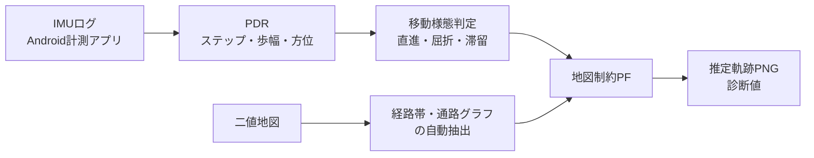

# 卒業研究 進捗報告メモ(夏休み明け打ち合わせ用)

2026-09-18 作成

## 要点

夏休み中に、地図制約付きParticle Filter(PF)の本研究独自の拡張をひととおり実装し、6シード×3CSVで効果を検証した。一番大きな成果は、1441/1442の性能差の真因がPDR上流(ステップ過検出と歩幅過小)の打ち消し合いだったと突き止め、是正したこと。

- 実装済み: 経路帯の自動抽出、不確実性適応粒子数、通路グラフと複数経路仮説、分岐の選別尤度、RMSE評価パイプライン
- 未完了: 時刻対応した正解位置データがまだ無いため、真のRMSEは出せていない
- 次の山場: kanri_4Fでの追加計測と正解位置の記録

## 研究の構成

スマートフォンIMUのPDRで歩行軌跡を出し、建物地図で制約した移動様態適応型PFで補正する。先行研究(SmartPDR、移動様態PF)の再現に、地図の使い方を中心とした本研究独自の拡張を加えている。

左から右へ処理が流れ、地図は経路帯・通路グラフとしてPFに入る。

| 要素 | 出典 | 先行研究との違い |
| --- | --- | --- |
| ステップ検出・歩幅推定 | SmartPDR | 被験者・端末向けの校正ゲインを追加 |
| 様態別の粒子数・ノイズ | 先行研究:移動様態PF | — |
| 壁尤度 | 本研究独自 | 0/1の二値判定ではなく、距離変換による連続値 |
| 屈折判定 | 本研究独自 | ヨーレートと方位変化のAND条件とヒステリシスで、手ぶれによる誤検出を抑える |
| 経路帯の自動抽出 | 本研究独自 | 手入力の経路を使わず、二値地図だけで空間制約を作る |
| 不確実性適応粒子数 | 本研究独自 | Neff比率に応じて粒子数を増減する |
| 通路グラフ・複数経路仮説 | 本研究独自 | 交差点で粒子を分岐させ、方位の一致度で選別する |

手入力の経路を使う条件(manual)は正解に近い情報を与えているので、比較用の条件として扱い、提案方式にはしない。

## 夏休み中にやったこと

8月5日に管理棟4Fで計測した3本のCSV(0805_1438/1441/1442)を主な評価データとして、実装と検証を進めた。検証は、PFの乱数シード6通り×3CSVで行った。

| 日付 | 内容 | 結果 |
| --- | --- | --- |
| 9月3日 | 計測当日のデータチェックツール(`quick_check.py`)、正解位置用の目印設計、計測アプリの改修、卒論の雛形作成 | 次回計測の準備が整った |
| 9月3日 | 分岐仮説の選別尤度 | 方位が良いCSVで終点x誤差が改善(1442: 194.7→127.8px、1441: 196.1→160.5px)。1438は悪化 |
| 9月2日 | RMSE評価パイプライン(`build_ground_truth.py`→`evaluate_accuracy.py`) | 合成データで動作を確認。実データの正解はまだ無い |
| 9月2日 | PDR上流の誤差の是正(次の節) | 歩数の誤差が±5%以内になった。全滅回数は平均15.6回→約2.4回 |
| 9月2日 | 初期方位の校正に「歩き始め基準」を追加 | 1441で全滅回数13.2→2.0回、経路の進捗率17%→74% |
| 8月30日 | 不確実性適応粒子数を既定ONに決定 | 6シードすべてで全滅回数が改善(9月2日に再検証して維持) |
| 8月30日 | 分岐先の選び方を方位で偏らせる方式 | 効果がなく不採用(9月3日の選別尤度で解決) |
| 8月16日 | 広い部屋の除外と通路中心線の抽出 | 全滅回数-16.8%、終点x誤差-18.5%(既定はOFF) |
| 8月16日 | 不確実性適応粒子数の感度分析(4パラメータ×14通り) | 初期値で妥当と確認 |
| 8月15日 | 経路帯の自動抽出(`route_source=auto`)と、手動経路との比較 | 平均では手動経路に劣るが、1442では自動のほうが良い |

9月2日より前の数値は、距離を正解に合わせ込む校正が入った条件のもので、現在の数値とは直接比較できない。ここでの誤差はすべて終点x誤差(代替指標)で、RMSEではない。

## 重要な発見: 誤差の原因はPFより上流にあった

1441と1442はほぼ同じ経路なのに結果が大きく違い、原因が分からないままだった。9月2日に、PFより前の距離推定に2つの大きな誤差があり、それが打ち消し合っていたことが分かった。

1. **ステップの過検出(約1.7〜1.8倍)**: 加速度の第2高調波(3.3〜3.4Hz)を歩行として数えていた。最短のピーク間隔を歩調の上限2.9Hzから計算するようにして直した。
2. **歩幅の過小推定(約1/2)**: SmartPDRの係数は元論文の被験者・端末で求めた値で、今回の条件に合わなかった。校正ゲイン(暫定値2.10)を追加した。
3. **打ち消し合いの割合が歩く速さで変わっていた**: ゆっくり歩いた1438(1.07m/s)は距離がほぼ正しく、速く歩いた1441/1442(1.40/1.47m/s)は距離が約4割足りなかった。距離が足りなければ、PFをどう改善しても終点には届かない。

あわせて次の2点も見直した。

- **距離を正解に合わせ込む校正を削除した**。以前の比較実験は、各CSVの総距離を正解(815px)に合わせた条件で行っていた。校正は全CSV共通の定数1つだけにした。
- **PFの重みの二重計上を削除した**。

教訓として、性能差の原因は、PFの設計より前にまず上流の距離と方位を疑うべきだった。この経緯は卒論の「失敗例」や「歩幅誤差の影響」の節に書ける。

## 現在の限界

一番大きい限界は評価データの不足で、独立した歩行データが3本しかなく、時刻対応した正解位置もない。複数シードで見ているのはPF内部の乱数のばらつきだけで、歩行サンプルは増えていない。

- **真のRMSEが出せていない**: 評価には終点x誤差という代替指標を使っている。評価パイプラインはできているが、合成データの値は研究結果として使わない。
- **歩幅の校正ゲイン2.10は暫定値**: 評価に使うのと同じ3CSVから求めており、校正用と評価用のデータが分かれていない。適用後も総距離に約±20%の誤差が残る。
- **CSVごとに方位の質が大きく違う**: 1442は良好、1441は初期の基準がずれている(歩き始め基準で改善)。1438は歩行中に正味+146度回っており、方位を使う機能では性能が悪化する。
- **経路帯の自動抽出には設計上の限界がある**: 通路と広い部屋の壁際を区別できない。部屋を除外する対策は、本物の合流点まで削る副作用があるため既定OFFにしている。
- **検証した地図が1つだけ**: 他の建物での汎用性は検証できていない。L字の合成地図には部屋がなく、代わりにはならない。卒論では今後の課題として書く予定。
- **地図の縮尺(11.4 px/m)を実測で確かめていない**。

## 今後の予定

次にやることは管理棟4Fでの追加計測で、校正用のデータと正解位置付きの評価データを同時に集める。計測経路(目印の順番)と当日のチェックツールは準備済み。

1. **現地の確認と採寸**
    - ドア4点の位置を実測する(現在は記憶による暫定値)
    - 約4.5mの4区間をメジャーで測り、地図の縮尺を確かめる
    - 建物の正式名称を確認する(設定名は「管理棟4F」だが、平面図の表題は「専門科目棟4階」)
2. **追加計測**
    - 校正用: 距離が分かっている直線を、ゆっくり・普通・速歩の3通りで歩く
    - 評価用: 目印を通るたびにアプリで地点マークを押しながら、複数の経路を歩く(逆方向・短い経路を含む)
    - 計測開始後は少し静止してから歩き始める(初期方位のずれを防ぐため)
3. **歩幅モデルの再同定**: 校正用データで校正ゲインを求め直し、評価データと分ける
4. **真のRMSEで比較実験をやり直す**: PDRのみ・固定PF・移動様態PF・提案方式を比べる。既定OFFの機能(分岐の選別尤度など)をONにするかも、ここで決める
5. **卒論の執筆**: 章立ての雛形(第1〜8章)はできている。第7章「実験結果」は空欄で、追加計測の結果を待っている

## スケジュール(提出の2027年2月後半から逆算)

毎日登校できる前提で、上の1〜4(採寸から解析まで)は約3〜4週間かかる見込み。中間発表(10月中旬の予定)に新しいデータを間に合わせるため、計測は9月中に終える。

| ステップ | 日数の目安 | 備考 |
| --- | --- | --- |
| 1. 現地採寸 | 1日 | 作業は2〜3時間。メジャー1本で足りる |
| 2. 帰宅後の準備 | 1日 | 経路シートの生成スクリプトは作成済み |
| 3. 追加計測 | 1〜2日 | 撮り直し用に1日。被験者を増やす場合は1人につき+1日 |
| 4. 解析 | 2〜3週間 | 再校正2〜3日、実データでの初RMSE3〜5日、比較実験1週間前後 |

夏休み中、1438の方位の問題は原因の特定まで約2週間かかった。新しいデータで同様の問題が出ることを見込み、1週間ほど予備を取る。

| 時期 | やること | 区切り |
| --- | --- | --- |
| 9月後半(〜9/30) | 採寸 → 準備 → 追加計測 | 評価データがそろう |
| 10月第1週 | 歩幅の再校正と、実データで最初のRMSE | 中間発表に載せる結果 |
| 10月中旬 | スライド作成(発表の1週間前から)と中間発表 | 中間発表 |
| 10月後半〜11月 | 発表の指摘を反映して比較実験。余力で研究を強化する。第1〜6章を執筆 | **実験は11月末で締め切る** |
| 12月 | 第7〜8章(結果・考察)を執筆 | 全章の初稿を先生に提出 |
| 1月 | 添削を受けて修正。図表と参考文献を仕上げる | 第2稿 |
| 2月前半〜提出 | 最終確認、発表準備 | 予備の2〜3週間 |

- **中間発表で見せるもの**: 研究の目的と提案方式、夏休みの成果(上流誤差の特定)、新データでの最初の結果(再校正後の歩幅誤差、1〜2条件分のRMSE)、残りの計画。
- **計測が10月にずれ込んだ場合**: 中間発表は、既存の3本のデータの結果と計測計画で発表する。
- **11月に研究を強化する候補**(10月の結果を見て1つ選ぶ): (1)他の階や建物での検証(汎用性を示せる。平面図が必要)、(2)被験者を2〜3人に増やす、(3)既定OFFの機能を詰めて提案方式に組み込む。(1)(2)は計測が要るので、9月の計測時に平面図の有無と協力者の当てを確認しておく。

## 指導教員に相談したいこと

- [ ] 追加計測の本数は、評価に足りると言えるのは何本か(現在の独立した歩行データは3本)
- [ ] 被験者が自分だけでよいか。他の人にも歩いてもらうべきか
- [ ] 他の建物での検証を今後の課題に回す方針でよいか
- [ ] 方位が壊れている1438を評価に残すか。残すなら、限界として扱ってよいか
- [ ] 手動経路(manual)を比較条件に含めるべきか
- [ ] 卒論の章立て(第1〜8章)の確認
- [ ] 中間発表の正式な日程と、発表で求められる内容
- [ ] 上のスケジュール(実験は11月末で締め切り、12月に全章の初稿)で問題ないか
